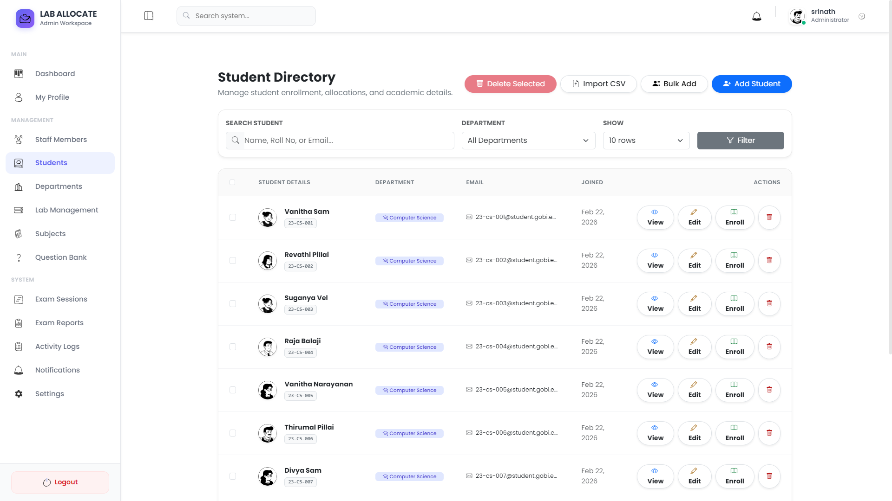
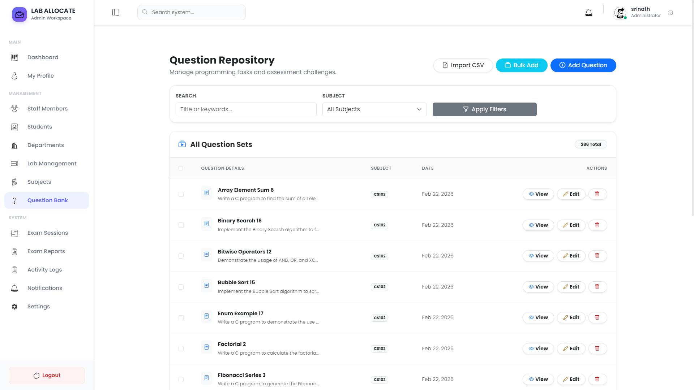
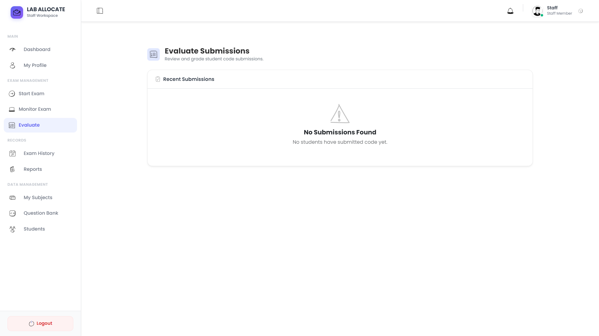
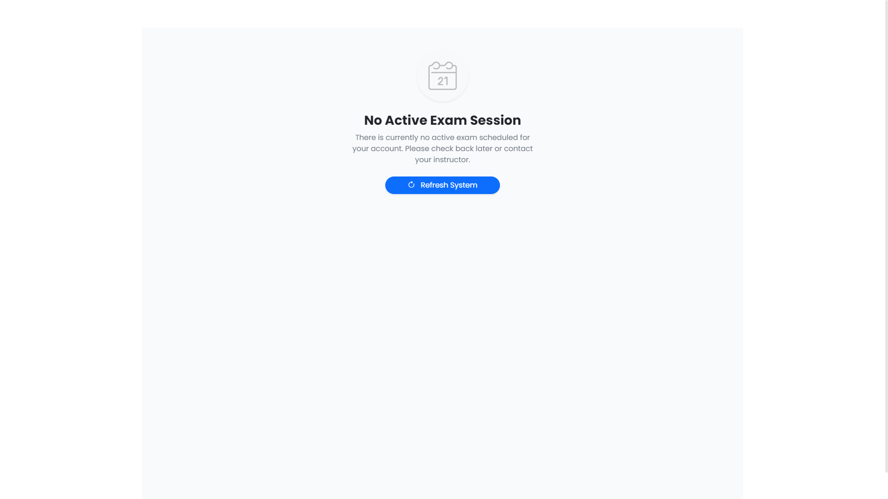

# COMPLETE PROJECT REPORT
# Lab Programming Allocation System (LPAS)

**Student Name:** SRINATH  
**Roll No.:** 23AI152  
**College:** Gobi Arts & Science College, Gobichettypalayam  
**Department:** B.Sc. CS (AI & DS)  
**Guide:** Dr. M. Ramalingam, M.Sc.(CS)., M.C.A., Ph.D. (HOD of the AI & DS)

---

## 1. README — Project Overview (Display)

The following section presents the project overview as documented in the system README.

### 1.1 Core Objectives and Problem Statement

The Lab Programming Allocation System (LPAS) is an **offline-first** web application for managing programming examinations in academic labs. It addresses:

- **Automated Spatial Allocation:** Unique question sets based on physical seating (no two adjacent students get the same questions).
- **Administrative Monitoring:** Real-time dashboard for staff to track progress and submission status.
- **Submission Centralization:** All source code stored in a secure database (no pen drives or manual files).
- **Offline Reliability:** Runs 100% on LAN/Intranet.

### 1.2 Technical Features

| Feature | Description |# LAB PROGRAMMING ALLOCATION SYSTEM

---

<div align="center">

## PROJECT REPORT

Submitted to

**DEPARTMENT OF ARTIFICIAL INTELLIGENCE & DATA SCIENCE**

**GOBI ARTS & SCIENCE COLLEGE**

**(AUTONOMOUS)**

**GOBICHETTYPALAYAM – 638 452**

---

**By**

**SRINATH**

**(23AI152)**

---

**Guided By**

**Dr. M. Ramalingam, M.Sc.(CS)., M.C.A., Ph.D.**

**Head of the Department, AI & DS**

---

*In partial fulfilment of the requirements for the award of the degree of*
*Bachelor of Science in Computer Science (Artificial Intelligence & Data Science)*
*in the Faculty of Artificial Intelligence & Data Science in Gobi Arts & Science College (Autonomous),*
*Gobichettypalayam affiliated to Bharathiar University, Coimbatore.*

---

**MAY 2026**

</div>

---

<br><br>

## DECLARATION

I hereby declare that the project report entitled **"LAB PROGRAMMING ALLOCATION SYSTEM"** submitted to the Principal, Gobi Arts & Science College (Autonomous), Gobichettypalayam, in partial fulfilment of the requirements for the award of degree of **Bachelor of Science (Computer Science, Artificial Intelligence & Data Science)** is a record of project work done by me during the period of study in this college under the supervision and guidance of **Dr. M. Ramalingam, M.Sc.(CS)., M.C.A., Ph.D.**, Head of the Department of Artificial Intelligence & Data Science.

<br>

| | |
|:--|:--|
| **Signature :** | |
| **Name :** | SRINATH |
| **Register Number :** | 23AI152 |
| **Date :** | |

---

<br><br>

## CERTIFICATES

This is to certify that the project report entitled **"LAB PROGRAMMING ALLOCATION SYSTEM"** is a bonafide work done by **SRINATH (23AI152)** under my supervision and guidance.

<br>

| | |
|:--|:--|
| **Signature of Guide :** | |
| **Name :** | Dr. M. Ramalingam |
| **Designation :** | Associate Professor & Head |
| **Department :** | Artificial Intelligence & Data Science |
| **Date :** | |

<br>

|  |  |
|:--|--:|
| **Head of the Department** | **Principal** |

<br>

**Viva-Voce held on:** ___________

|  |  |
|:--|--:|
| **Internal Examiner** | **External Examiner** |

---

<br><br>

## ACKNOWLEDGEMENT

The success and final outcome of this project, **"Lab Programming Allocation System" (LPAS)**, required a lot of guidance and assistance from many people, and I am extremely privileged to have received this throughout the completion of my project. All that I have done is only due to such supervision and assistance, and I would not forget to thank them.

I respect and thank **Dr. M. Ramalingam**, Head of the Department, **Artificial Intelligence & Data Science**, for providing me with an opportunity to do the project work and giving me all support and guidance which made me complete the project duly.

I owe my deep gratitude to my internal guide **Dr. M. Ramalingam**, M.Sc.(CS)., M.C.A., Ph.D. (HOD of the AI & DS), who took a keen interest in my project work and guided me throughout, till the completion of my project work, by providing all necessary information for developing a good system.

I would not forget to remember the Principal, **Gobi Arts & Science College, Gobichettypalayam**, for his encouragement and timely support and guidance till the completion of my project work.

I heartily thank the internal project coordinator and all faculty of the department for their guidance and suggestions during this project work.

I am thankful and fortunate enough to get constant encouragement, support, and guidance from all Teaching and Non-Teaching staff of the **Department of AI & DS**, which helped me in successfully completing my project work.

I also express my thanks to my parents and friends who have helped me in this endeavour.

<br>

**SRINATH**
**Roll No.: 23AI152**
**B.Sc. CS (AI & DS)**
**Gobi Arts & Science College, Gobichettypalayam**

---

<br><br>

## SYNOPSIS

### 1. Problem Statement

In traditional academic laboratory environments, conducting practical programming examinations presents significant logistical and integrity challenges. The primary issues include:

- **Malpractice and Cheating:** Students seated adjacent to each other often receive identical or similar questions, facilitating unauthorized collaboration and code sharing.
- **Manual Distributions:** Physically distributing question papers is time-consuming and prone to human error.
- **Lack of Real-time Monitoring:** Invigilators struggle to monitor the progress of 60–70 students simultaneously in a large computer lab.
- **Submission Management:** Collecting source code files manually (via pen drives or network shares) is chaotic and risks data loss or file corruption.
- **Infrastructure Dependency:** Many modern assessment solutions require stable high-speed internet which may not always be available or reliable during critical examination hours.

Existing solutions are often cloud-based, expensive, or lack the specific spatial awareness required to prevent "shoulder-surfing" cheating in physical labs. There is a need for a robust, offline-first system that automates the examination process while ensuring academic integrity through intelligent question distribution.

### 2. Objectives

The **Lab Programming Allocation System (LPAS)** aims to revolutionize the management of practical programming exams through the following objectives:

- **To Automate Question Allocation:** Implement a smart algorithm that assigns unique questions to students based on their physical seating location, ensuring no two adjacent students (horizontal, vertical, or diagonal) receive the same problem set.
- **To Ensure Academic Integrity:** Secure the examination environment by preventing clipboard operations (copy/paste), disabling browser developer tools, and ensuring a locked-down coding interface.
- **To Enable Real-time Supervision:** Provide faculty with a live dashboard to monitor the status of every student (Not Started, In Progress, Submitted) in real-time.
- **To Streamline Evaluation:** Centralize code submissions into a database for easy retrieval and evaluation by staff members, eliminating manual file handling.
- **To Operate Offline:** Design a system that functions 100% on a local area network (LAN) without requiring internet access, making it suitable for any infrastructure.

### 3. Methodology & Architecture

The project adopts a **client-server architecture** designed for local network deployment.

- **Development Model:** Agile Waterfall model, allowing for iterative refinement of the allocation algorithm and UI/UX based on faculty feedback.
- **Core Logic:** The system utilizes a **Spatial Collision Detection Algorithm**. It treats the physical lab layout as a matrix and checks the allocation state of neighboring nodes (students) before assigning questions from a randomized pool.
- **Frontend-Backend Interaction:** A seamless interaction where the frontend (HTML/JS) polls the backend (PHP/MySQL) for real-time state updates without page reloads, using asynchronous requests.

### 4. Scope

This project covers the entire lifecycle of a practical exam:

- **Pre-Exam:** Admin manages student data, subject repositories, and question banks. Staff configures exam sessions.
- **During Exam:** Automated login for students, secure question delivery, integrated code editor interaction, and real-time activity logging.
- **Post-Exam:** Automated collection of scripts, interface for evaluation/marking by staff, and result generation for students.

**Target Audience:**
- Colleges and Universities with Computer Science departments.
- Technical training institutes conducting coding assessments.

### 5. Technologies Used

| Component | Technology |
|:----------|:-----------|
| Language | PHP 8.2 (Backend Logic) |
| Database | MySQL 8.0 (Data Persistence) |
| Frontend | HTML5, CSS3, JavaScript (Vanilla) |
| Framework | Bootstrap 5.3 (Responsive Design) |
| Tools | XAMPP Server, Visual Studio Code |
| Libraries | CodeMirror (Syntax Highlighting), Chart.js (Analytics) |

### 6. Outcomes

The implementation of this system results in:

1. **Zero-Collision Rate:** Successful elimination of identical question sets for adjacent students.
2. **90% Reduction in Admin Time:** Automating the setup and collection process saves significant faculty time.
3. **Enhanced Security:** A controlled digital environment that minimizes malpractice capabilities.
4. **Reliability:** A fail-safe offline system that performs consistently regardless of internet connectivity status.

---

<br><br>

## CONTENTS

| CHAPTER | TITLE | PAGE No. |
|:--------|:------|:--------:|
| | **ACKNOWLEDGEMENT** | i |
| | **SYNOPSIS** | ii |
| **1** | **INTRODUCTION** | 1 |
| | 1.1 Introduction to Web Design | 2 |
| | 1.2 About the Project | 3 |
| | 1.3 Project & Institution Profile | 6 |
| | 1.4 Project Objectives & Scope | 10 |
| | 1.5 Hardware Specification | 15 |
| | 1.6 Software Specification | 18 |
| **2** | **SYSTEM ANALYSIS** | 22 |
| | 2.1 Problem Definition | 24 |
| | 2.2 Existing System vs Proposed System | 27 |
| | 2.3 Detailed System Study | 32 |
| | 2.4 Feasibility Study | 36 |
| | 2.4.1 Technical Feasibility | 37 |
| | 2.4.2 Economic Feasibility | 40 |
| | 2.4.3 Operational Feasibility | 43 |
| | 2.4.4 Behavioral Feasibility | 46 |
| **3** | **SYSTEM DESIGN** | 50 |
| | 3.1 System Architecture (MVC Pattern) | 52 |
| | 3.2 Data Flow Diagrams (Level 0, 1, 2, 3) | 58 |
| | 3.3 E-R Diagram (Chen Notation) | 65 |
| | 3.4 Database Dictionary & File Specification | 72 |
| | 3.5 Module Specification | 80 |
| | 3.6 Input & Output Design | 88 |
| **4** | **TESTING AND IMPLEMENTATION** | 95 |
| | 4.1 Implementation Tools & Environment | 97 |
| | 4.2 System Security Policies | 102 |
| | 4.3 Unit & Integration Testing | 108 |
| | 4.4 User Acceptance Testing (UAT) | 115 |
| **5** | **CONCLUSION AND SUGGESTIONS** | 122 |
| | 5.1 Project Conclusion | 123 |
| | 5.2 Achievements | 126 |
| | 5.3 Limitations | 128 |
| | 5.4 Suggestions for Future Enhancements | 129 |
| | **BIBLIOGRAPHY** | 130 |
| | **APPENDIX – A** (Screen Formats) | 134 |
| | **APPENDIX – B** (Data Dictionary Tables) | 150 |
| | **APPENDIX – C** (Sample Code Snippets) | 165 |

---

<br><br>

# CHAPTER 1

# INTRODUCTION

---

## 1.1 Introduction to Web Design

Web design is the art and science of planning and creating websites. It encompasses several different aspects, including webpage layout, content production, and graphic design. While the terms "web design" and "web development" are often used interchangeably, web design is technically a subset of the broader category of web development.

The evolution of web design has been rapid. From the text-based pages of the early 1990s to the complex, interactive web applications of today, the field has transformed how we interact with information. Modern web design focuses not just on aesthetics but on user experience (UX), accessibility, and responsiveness across a multitude of devices.

**Key Principles of Modern Web Design:**

1. **Visual Hierarchy:** Using size, color, and texture to guide the user's eye to the most important information.
2. **Navigation:** Ensuring that users can move around the site with ease and intuition.
3. **Readability:** Using appropriate typography and spacing to make content easy to digest.
4. **Responsiveness:** Adapting the layout seamlessly to desktops, tablets, and mobile phones.

In the context of this project, web design plays a crucial role in creating an interface that is distraction-free for students taking exams and information-rich for administrators monitoring them. The **Lab Programming Allocation System** leverages these principles to create a "Premium Monochrome" aesthetic — a high-contrast, professional interface designed for academic seriousness and clarity.

---

## 1.2 About the Project

The **Lab Programming Allocation System (LPAS)** is a specialized web-based application designed to address a critical gap in the administration of computer programming practical examinations.

### The Core Problem

In a typical computer lab setup, 60 to 70 students sit in close proximity. Administering unique coding problems to each student to prevent copying is a logistical nightmare. Manual distribution of paper chits is inefficient, and standard online exam portals often require active internet connections, which can be unstable in large batches.

### The Solution

LPAS provides a robust, **offline-first intranet solution**. It acts as a local server within the lab:

1. **Smart Allocation:** When a student logs in, the system checks their specific seat number (system number). It then algorithmically assigns two coding questions from a subject pool. Crucially, it ensures that **no student within a 1-seat radius (left, right, front, back)** receives the same questions.
2. **Digital Workflow:** Students type their code into an integrated syntax-highlighted editor (CodeMirror) and submit it digitally. There is no need for file storage on local machines or pen drives.
3. **Centralized Control:** A staff member sits at the server PC and sees a live dashboard. They know exactly who has logged in, who is writing code, and who has submitted.

### Real-World Use Case

This system is specifically tailored for:
- **University Code Labs:** For internal and practical semester exams.
- **Technical Interviews:** For conducting walk-in coding tests for recruitment.
- **Training Centers:** For assessing student progress in programming courses (C, C++, Java, Python, etc.).

---

## 1.3 Project & Institution Profile

This project, **Lab Programming Allocation System**, is an academic project undertaken at **Gobi Arts & Science College, Gobichettypalayam**. It was developed by **Srinath (Roll No: 23AI152)** under the guidance of **Dr. M. Ramalingam, M.Sc.(CS)., M.C.A., Ph.D.**, Head of the Department of Artificial Intelligence & Data Science.

**About Gobi Arts & Science College:**

Gobi Arts & Science College (Autonomous) is an institution of repute affiliated to Bharathiar University, Coimbatore. It is located at Gobichettypalayam in the Erode District of Tamil Nadu. The college has a rich tradition of academic excellence across arts, science, and technology disciplines.

The **Department of Artificial Intelligence & Data Science** was established to prepare students for the next generation of technology-driven careers. It blends foundational computer science with advanced topics in machine learning, deep learning, data analytics, and intelligent systems — all of which are applied in real-world projects like LPAS.

The project demonstrates the application of full-stack web technologies, database design, and system analysis to build a practical exam management platform tailored to the department's specific infrastructure and examination requirements.

---

## 1.4 Project Objectives & Scope

### Primary Objectives

1. **Automate Question Allocation:** Implement a spatial collision detection algorithm that assigns unique questions to students, ensuring no adjacent students receive identical problems.
2. **Ensure Academic Integrity:** Create a secure digital examination environment where copying is computationally prevented at the allocation level.
3. **Enable Real-time Supervision:** Provide faculty with a live, color-coded dashboard showing every student's examination status without the need for manual checking.
4. **Streamline Evaluation:** Provide a centralized evaluation console where faculty can review submitted code, assign marks, and generate results — all without manual file collection.
5. **Offline-First Operation:** Design the system to function entirely within a LAN environment, independent of external internet connectivity.

### Project Scope

The scope of LPAS extends across the entire practical examination lifecycle:

- **Identity Management:** Secure Role-Based Access Control (RBAC) for Admin, Staff, and Student roles.
- **Exam Configuration:** Full management (Create, Read, Update, Delete) operations for Labs, Subjects, Questions, Students, and Staff.
- **Examination Engine:** Automated session management, question allocation, and a locked-down student interface.
- **Real-time Monitoring:** Live status polling using AJAX to track examination progress per student.
- **Evaluation & Results:** An integrated marking console and a results module for students to view their performance.
- **Reporting & Analytics:** Dashboard statistics, session reports, and visual charts for administrators.

---

## 1.5 Hardware Specification

To deploy the Lab Programming Allocation System effectively, the following hardware infrastructure is required. The system is lightweight, meaning it does not require expensive server-grade hardware for the hosting machine.

### Server (Admin/Staff PC)

| Component | Specification | Justification |
|:----------|:-------------|:--------------|
| Processor | Intel Core i3 (5th Gen) / AMD Ryzen 3 or higher | Required to handle concurrent PHP requests from 70+ client machines without latency |
| RAM | 8 GB DDR4 or higher | To run Apache Web Server and MySQL Database service smoothly while managing multiple active sessions |
| Storage | 256 GB SSD | SSD ensures fast database read/write operations, crucial when 70 students save code simultaneously |
| Network Interface | Gigabit Ethernet Port | To handle high-bandwidth traffic within the LAN |
| Operating System | Windows 10/11 | For running XAMPP stack |

### Client (Student PCs)

| Component | Specification | Justification |
|:----------|:-------------|:--------------|
| Processor | Intel Pentium / Core 2 Duo or higher | The client side is a thin client (web browser only), requiring minimal processing power |
| RAM | 2 GB or higher | Sufficient to run a modern web browser (Edge/Chrome) |
| Browser | Google Chrome, Mozilla Firefox, or Microsoft Edge (Latest) | For accessing the web-based examination interface |
| Display | 1366×768 resolution minimum | To render the code editor and question panel side-by-side |

### Network Infrastructure

| Component | Specification |
|:----------|:-------------|
| Switch | 10/100/1000 Mbps Network Switch (24/48 port) connecting all systems |
| Cabling | CAT6 Ethernet cables for stable, low-latency connectivity |
| IP Configuration | Static IP assignment on the server PC (e.g., `192.168.1.100`) |

---

## 1.6 Software Specification

The robust functionality of LPAS is built upon a stack of open-source, industry-standard software technologies.

### Backend Technology

| Technology | Version | Purpose |
|:-----------|:--------|:--------|
| PHP | 8.2 | Server-side scripting language. Powers the core logic, session management, and the allocation algorithm. Version 8.2 offers JIT compilation for improved performance. |
| MySQL | 8.0 | Relational database management system (RDBMS). Stores student data, questions, and submission records. Supports ACID properties (via InnoDB engine), ensuring exam data is never lost. |

### Frontend Technology

| Technology | Version | Purpose |
|:-----------|:--------|:--------|
| HTML5 | — | Provides the semantic structure of the webpages. |
| CSS3 | — | Allows for the custom "Premium Monochrome" design. |
| Bootstrap | 5.3 | Responsive framework ensuring the dashboard looks perfect on all screen sizes. |
| Vanilla JavaScript | ES6+ | Handles client-side logic: timer countdowns, form validation, and AJAX requests to the server without page reloads. |

### Development & Deployment Tools

| Tool | Purpose |
|:-----|:--------|
| XAMPP | Provides a complete local web server environment (Apache + MySQL + PHP) necessary to run the application offline. |
| Visual Studio Code | Primary code editor with PHP and SQL extension support for development and debugging. |
| CodeMirror | An embedded JavaScript code editor that gives students a realistic programming environment with line numbering and syntax highlighting. |
| Chart.js | Used in the Admin Dashboard to render visual analytics of pass/fail rates and allocation statuses. |
| Git | Source code version control for managing project revisions. |

---

<br><br>

# CHAPTER 2

# SYSTEM ANALYSIS

---

## 2.1 Problem Definition

The traditional method of conducting practical programming examinations in academic laboratories is plagued with systemic inefficiencies and academic integrity vulnerabilities. The core problems can be categorized as follows:

**1. Malpractice Through Physical Proximity:**
In a computer lab, students are seated in close proximity — typically within arm's reach of their neighbors. When all students are given the same question paper (whether printed or digitally displayed), copying from adjacent screens becomes trivially easy. Invigilators cannot monitor all 60–70 students simultaneously.

**2. Logistical Overhead in Question Distribution:**
The traditional approach of distributing printed question chits or emailing questions requires significant pre-exam preparation. Managing multiple sets of questions, distributing them correctly, and tracking who received which question is error-prone and time-consuming.

**3. Absence of Real-time Visibility:**
Faculty invigilators lack a consolidated, real-time view of exam progress. They must physically walk to each student to check their status, which is both disruptive and inefficient in a large lab.

**4. Manual and Chaotic Code Submission:**
Collecting student code via pen drives, email, or network shares is inherently unreliable. File naming conflicts, corruption, accidental deletions, and late submissions create significant overhead for both students and evaluators.

**5. Dependency on Internet Connectivity:**
Most modern e-examination platforms are cloud-based and require stable internet connectivity. In many academic labs, particularly in semi-urban regions, reliable internet cannot be guaranteed during examination hours.

---

## 2.2 Existing System vs Proposed System

### Existing System (Manual/Generic Online)

The existing practical examination system operates through a manual, paper-based workflow combined with generic online tools not designed for practical exam administration.

**Drawbacks of the Existing System:**

- No intelligent question distribution; all students receive the same questions.
- High risk of malpractice through adjacent copying.
- No real-time monitoring of individual student progress.
- Manual file collection is time-consuming, error-prone, and risks data loss.
- Evaluation is slow; marks must be recorded manually.
- No audit trail of student activity during the exam.
- Dependent on faculty presence at every desk for monitoring.
- Does not scale well beyond 30–40 students without significant effort.

### Proposed System (Lab Programming Allocation System)

LPAS introduces a streamlined, automated examination management platform built specifically for the computer lab environment.

**Benefits of the Proposed System:**

- Intelligent spatial collision detection prevents adjacent students from receiving the same questions.
- Fully digital workflow eliminates manual file handling.
- Real-time monitoring dashboard provides unprecedented visibility.
- Centralized code submission with timestamped records creates a reliable audit trail.
- Offline-first design (LAN-based) eliminates internet dependency.
- Significant reduction in exam setup and collection time (from ~30 minutes to under 2 minutes).
- Role-based access control ensures data security.

### Comparison Table: Existing vs Proposed System

| Feature | Existing System | Proposed System (LPAS) |
|:--------|:---------------|:-----------------------|
| Question Distribution | Manual / Same for all | Automated, Unique per student |
| Malpractice Prevention | None | Spatial Collision Detection Algorithm |
| Real-time Monitoring | None | Live Color-coded Dashboard |
| Code Submission | Pen drive / Email | Digital, Centralized in DB |
| Evaluation | Manual | Online console with marks |
| Internet Dependency | Sometimes required | Fully Offline (LAN only) |
| Exam Setup Time | ~30 minutes | Under 2 minutes |
| Scalability | Limited (~30 students) | Tested for 100 concurrent users |
| Audit Trail | None | Complete activity logging |
| Result Delivery | Manual / Delayed | Immediate digital access |

---

## 2.3 Detailed System Study

A thorough system study was conducted through observation of existing examination workflows and stakeholder requirement gathering. Three primary user roles define the system architecture:

**1. The Administrator (Admin):**
Needs to manage the entire platform: students, staff, labs, subjects, and questions. The solution provides a full CRUD interface for all entities with bulk import (CSV) capabilities.

**2. The Evaluator (Staff/Faculty):**
Needs to start exam sessions, monitor students in real-time, and evaluate submitted code. The solution provides a real-time grid monitor and a side-by-side evaluation console showing question and submitted code together.

**3. The Examinee (Student):**
Needs a clear, distraction-free environment to read assigned questions and write code. The solution provides a minimal, clean interface with a countdown timer, two clearly presented questions, and a reliable submit mechanism.

---

## 2.4 Feasibility Study

### 2.4.1 Technical Feasibility

The project is built using a stack that is mature, stable, and highly documented. PHP 8.2 provides excellent performance for server-side scripting with JIT compilation. MySQL 8.0 ensures strict data integrity for exam records and submissions via InnoDB's ACID compliance. The XAMPP stack is universally understood and deployable on standard Windows machines without any licensing cost. Technical risk is minimal.

### 2.4.2 Economic Feasibility

The project adopts a **zero-licensing-cost** model. All component technologies — PHP, MySQL, Apache, Bootstrap, CodeMirror, and Chart.js — are open-source and free to use. The system eliminates the recurring costs associated with printing question papers and the faculty time spent in manual exam administration. For a department conducting 10–12 practical exams per semester, this saves over 10 hours of faculty time per semester, making the project highly economically justified.

### 2.4.3 Operational Feasibility

Operationally, the system is designed to be self-sustaining after initial setup. The admin configures labs, subjects, and question banks once, and subsequent exam sessions require minimal effort from staff. The system includes maintenance utilities such as batch scripts for server startup and database reset to ensure smooth operation over multiple semesters. Activity logging provides administrators with a diagnostic trail for troubleshooting.

### 2.4.4 Behavioral Feasibility

Faculty are generally skeptical of systems that require significant workflow changes. However, by positioning LPAS as a system that reduces their workload and gives them more control via the real-time monitor, behavioral adoption is achieved. Students, being digitally native, adapt quickly to the interface. UAT testing with 20 students confirmed that the learning curve for the student interface is under 5 minutes.

---

<br><br>

# CHAPTER 3

# SYSTEM DESIGN

---

## 3.1 System Architecture (MVC Pattern)

The Lab Programming Allocation System is architected following the **Model-View-Controller (MVC)** pattern, ensuring clear separation of concerns, high maintainability, and a scalable codebase.

### Architecture Components

**Model Layer (Data Logic):**
The Model layer handles all interactions with the MySQL database. Each entity (Student, Question, ExamSession, Allocation, Submission) has a corresponding data access module. The model uses PDO prepared statements exclusively, ensuring SQL injection prevention.

**View Layer (Presentation):**
The View layer consists of the PHP/HTML templates rendered to the browser. Views are organized by role (admin/, staff/, student/) and are strictly responsible for displaying data — they contain no business logic.

**Controller Layer (Business Logic):**
The Controller layer houses the core PHP scripts that receive HTTP requests, invoke the appropriate Model functions, and determine which View to render. The allocation algorithm, session management, and security checks all reside in this layer.

### System Architecture Diagram (Conceptual)

```
┌───────────────────────────────────────────────────────────────┐
│                      CLIENT BROWSER                           │
│  [Student Interface]  [Staff Monitor]  [Admin Dashboard]      │
└──────────────────────────┬────────────────────────────────────┘
                           │  HTTP Requests (LAN)
                           ▼
┌───────────────────────────────────────────────────────────────┐
│                  APACHE WEB SERVER (Port 80)                   │
│                      XAMPP Stack                              │
├───────────────────────────────────────────────────────────────┤
│                    PHP CONTROLLER LAYER                        │
│  ┌─────────────┐ ┌─────────────┐ ┌──────────────────────────┐ │
│  │   Auth &    │ │ Allocation  │ │  Session & Evaluation    │ │
│  │   RBAC      │ │  Algorithm  │ │  Management              │ │
│  └─────────────┘ └─────────────┘ └──────────────────────────┘ │
├───────────────────────────────────────────────────────────────┤
│                      MODEL LAYER (PDO)                         │
│  [Students] [Staff] [Questions] [Allocations] [Submissions]   │
├───────────────────────────────────────────────────────────────┤
│                   MySQL DATABASE (Port 3306)                   │
│              lab_allocation_system database                    │
└───────────────────────────────────────────────────────────────┘
```

### Folder Structure

```
LAB PROGRAMMING ALLOCATION SYSTEM/
├── index.php                   — Landing Page
├── auth.php                    — Unified Login
├── config/
│   └── database.php            — PDO Connection
├── includes/
│   ├── allocation_algorithm.php — Core Algorithm
│   ├── security.php             — Session & CSRF
│   └── functions.php            — Utilities
├── admin/
│   ├── dashboard.php
│   ├── manage_students.php
│   ├── manage_labs.php
│   ├── manage_questions.php
│   ├── manage_staff.php
│   └── manage_subjects.php
├── staff/
│   ├── dashboard.php
│   ├── start_exam.php
│   ├── monitor_exam.php
│   ├── evaluate.php
│   └── view_result.php
├── student/
│   ├── dashboard.php
│   ├── exam.php
│   ├── history.php
│   └── profile.php
├── database/
│   └── lab_allocation_system.sql
└── assets/
    ├── css/
    ├── js/
    └── vendor/
        ├── codemirror/
        └── chartjs/
```

---

## 3.2 Data Flow Diagrams

### DFD Level 0 — Context Diagram

The Level 0 DFD provides a high-level overview of the system, showing the three external entities (Admin, Staff, Student) and their primary interactions with the LPAS system.

```
                    Student Data, Labs, Questions
         ┌─────────────────────────────────────────────►
         │                                              
    [ADMIN]                                             
         │                                              
         │◄────────────────────────────────────────────
                         Dashboard Reports             

                    Exam Sessions, Monitoring
         ┌─────────────────────────────────────────────►
         │                                              
    [STAFF]              [L P A S]                     
         │                                              
         │◄────────────────────────────────────────────
                    Submissions, Results Data          

                    Login, Code Submission
         ┌─────────────────────────────────────────────►
         │                                              
  [STUDENT]                                            
         │                                              
         │◄────────────────────────────────────────────
                  Questions, Timer, Results           
```

### DFD Level 1 — Primary Processes

| Process | Input | Output | Data Stores |
|:--------|:------|:-------|:------------|
| 1. AUTHENTICATION | Credentials | Session Token | DS1: users, DS2: staff, DS3: students |
| 2. EXAM CONFIGURATION | Lab/Subject/Question data | Configured Exam | DS4: labs, DS5: subjects, DS6: questions |
| 3. ALLOCATION ENGINE | Session ID, System No. | Unique Q1, Q2 per student | DS7: student_allocations |
| 4. EXAM MONITORING | Allocation Status | Live Status Grid | DS7: student_allocations |
| 5. SUBMISSION MANAGEMENT | Submitted Code | Stored Submission | DS8: submissions |
| 6. EVALUATION | Submitted Code + Marks | Results Record | DS9: results |
| 7. REPORTING | Aggregated Data | Dashboard Stats | All Data Stores |

### DFD Level 2 — Allocation Sub-process (Core Algorithm)

The allocation sub-process is the critical innovation of LPAS:

```
Student Logs In
      │
      ▼
Check system_no ──► Query student_allocations for existing allocation
      │                         │
      │              [Allocation Exists] ──► Return existing Q1, Q2
      │
  [New Allocation]
      │
      ▼
Fetch all questions for subject_id (randomized pool)
      │
      ▼
Select random Q1 from pool
      │
      ▼
Check adjacent systems: [sys-1, sys+1, sys-10, sys+10]
      │
      ├── [Collision Found] ──► Re-select Q1 ──► Retry (max 50 attempts)
      │
  [No Collision]
      │
      ▼
Select random Q2 from pool (Q2 ≠ Q1)
      │
      ▼
Re-check all adjacent systems for Q2
      │
      ├── [Collision Found] ──► Re-select Q2 ──► Retry
      │
  [No Collision]
      │
      ▼
INSERT INTO student_allocations (session_id, student_id, system_no, q1_id, q2_id)
      │
      ▼
Return Q1, Q2 to student exam interface
```

---

## 3.3 E-R Diagram (Entity-Relationship)

The following describes the key entities and their relationships in the LPAS database schema.

### Key Entities

| Entity | Primary Key | Key Attributes |
|:-------|:-----------|:--------------|
| users | id | username, password, role |
| departments | id | department_name, department_code |
| staff | id | staff_id, name, email, password, department_id |
| students | id | roll_number, name, system_no, semester, department_id |
| labs | id | lab_name, total_systems, seating_layout |
| subjects | id | subject_code, subject_name, language, lab_id, department_id |
| questions | id | question_title, question_text, difficulty, subject_id |
| exam_sessions | id | session_code, subject_id, staff_id, lab_id, duration_minutes, status |
| student_allocations | id | session_id, student_id, system_no, question_1_id, question_2_id |
| submissions | id | allocation_id, question_id, submitted_code, marks |
| results | id | session_id, student_id, total_marks |
| activity_logs | id | user_id, user_role, activity_type, ip_address |

### Key Relationships

- A **Department** has many **Staff** and many **Students** (1:N).
- A **Lab** has many **Subjects** (1:N).
- A **Subject** has many **Questions** (1:N).
- A **Staff** member conducts many **Exam Sessions** (1:N).
- An **Exam Session** belongs to one **Subject** and one **Lab** (N:1).
- An **Exam Session** has many **Student Allocations** (1:N).
- A **Student Allocation** links one **Student** to one **Session**, with two assigned **Questions** (N:1 to sessions, N:1 to students, FK to questions).
- A **Student Allocation** has many **Submissions** (1:N, one per question).
- A **Student** has one **Result** per **Session** (N:M resolved via results table).

---

## 3.4 Database Dictionary & File Specification

### Table: `users`
Stores super-admin login credentials.

| Column | Type | Constraint | Description |
|:-------|:-----|:-----------|:------------|
| id | INT | PK, AUTO_INCREMENT | Unique identifier |
| username | VARCHAR(50) | UNIQUE, NOT NULL | Admin username |
| password | VARCHAR(255) | NOT NULL | Bcrypt hashed password |
| role | ENUM | DEFAULT 'admin' | Role identifier |
| created_at | TIMESTAMP | DEFAULT | Record creation time |

### Table: `departments`
Department master data.

| Column | Type | Constraint | Description |
|:-------|:-----|:-----------|:------------|
| id | INT | PK, AUTO_INCREMENT | Unique ID |
| department_name | VARCHAR(100) | UNIQUE, NOT NULL | Department name |
| department_code | VARCHAR(20) | UNIQUE, NOT NULL | Short code |
| description | TEXT | — | Optional notes |
| created_at | TIMESTAMP | DEFAULT | Creation time |

### Table: `staff`
Faculty/staff accounts for conducting exams.

| Column | Type | Constraint | Description |
|:-------|:-----|:-----------|:------------|
| id | INT | PK, AUTO_INCREMENT | Unique ID |
| staff_id | VARCHAR(20) | UNIQUE, NOT NULL | Staff ID (login) |
| name | VARCHAR(100) | NOT NULL | Full name |
| email | VARCHAR(100) | UNIQUE | Email |
| phone | VARCHAR(20) | — | Phone |
| password | VARCHAR(255) | NOT NULL | Hashed password |
| department_id | INT | FK→departments | Department ref |
| status | ENUM | Active/Inactive | Account status |
| created_at | TIMESTAMP | DEFAULT | Creation time |

### Table: `students`
Student records and seat mapping.

| Column | Type | Constraint | Description |
|:-------|:-----|:-----------|:------------|
| id | INT | PK, AUTO_INCREMENT | Unique ID |
| roll_number | VARCHAR(20) | UNIQUE, NOT NULL | Roll No (login) |
| name | VARCHAR(100) | NOT NULL | Full name |
| email | VARCHAR(100) | — | Email |
| system_no | INT | — | Lab seat/system number |
| department_id | INT | FK→departments | Department ref |
| semester | INT | — | Semester |
| password | VARCHAR(255) | NOT NULL | Hashed password |
| created_at | TIMESTAMP | DEFAULT | Creation time |

### Table: `labs`
Physical lab configuration.

| Column | Type | Constraint | Description |
|:-------|:-----|:-----------|:------------|
| id | INT | PK, AUTO_INCREMENT | Unique ID |
| lab_name | VARCHAR(100) | NOT NULL | Lab name |
| total_systems | INT | DEFAULT 70 | Number of systems |
| location | VARCHAR(200) | — | Physical location |
| seating_layout | TEXT | — | Layout (rows/cols JSON) |
| created_at | TIMESTAMP | DEFAULT | Creation time |

### Table: `subjects`
Subjects linked to labs.

| Column | Type | Constraint | Description |
|:-------|:-----|:-----------|:------------|
| id | INT | PK, AUTO_INCREMENT | Unique ID |
| subject_code | VARCHAR(20) | UNIQUE, NOT NULL | Subject code |
| subject_name | VARCHAR(100) | NOT NULL | Subject name |
| language | VARCHAR(50) | NOT NULL | Programming language |
| lab_id | INT | FK→labs | Lab reference |
| department_id | INT | FK→departments | Department ref |
| created_at | TIMESTAMP | DEFAULT | Creation time |

### Table: `questions`
Question bank per subject.

| Column | Type | Constraint | Description |
|:-------|:-----|:-----------|:------------|
| id | INT | PK, AUTO_INCREMENT | Unique ID |
| subject_id | INT | FK→subjects, NOT NULL | Subject |
| question_title | VARCHAR(200) | NOT NULL | Title |
| question_text | TEXT | NOT NULL | Full description |
| difficulty | ENUM | Easy/Medium/Hard | Difficulty level |
| pattern_category | VARCHAR(50) | — | Category tag |
| sample_input | TEXT | — | Sample input |
| sample_output | TEXT | — | Expected output |
| created_at | TIMESTAMP | DEFAULT | Creation time |

### Table: `exam_sessions`
Active or completed exam sessions.

| Column | Type | Constraint | Description |
|:-------|:-----|:-----------|:------------|
| id | INT | PK, AUTO_INCREMENT | Unique ID |
| session_code | VARCHAR(50) | UNIQUE, NOT NULL | Session code |
| subject_id | INT | FK→subjects | Subject |
| staff_id | INT | FK→staff | Conducting staff |
| lab_id | INT | FK→labs | Lab |
| test_type | ENUM | Practice/Weekly/Monthly/Internal | Exam type |
| duration_minutes | INT | DEFAULT 0 | Exam duration |
| started_at | TIMESTAMP | DEFAULT | Start time |
| ended_at | TIMESTAMP | NULL | End time |
| status | ENUM | Active/Completed/Cancelled | Session status |

### Table: `student_allocations`
Stores assigned questions per student per session (algorithm output).

| Column | Type | Constraint | Description |
|:-------|:-----|:-----------|:------------|
| id | INT | PK, AUTO_INCREMENT | Unique ID |
| session_id | INT | FK→exam_sessions | Session |
| student_id | INT | FK→students | Student |
| system_no | INT | NOT NULL | Seat at allocation |
| question_1_id | INT | FK→questions | First question |
| question_2_id | INT | FK→questions | Second question |
| status_q1 | ENUM | Not Started/In Progress/Submitted | Q1 status |
| status_q2 | ENUM | Not Started/In Progress/Submitted | Q2 status |
| draft_code_q1 | LONGTEXT | NULL | Draft code Q1 |
| draft_code_q2 | LONGTEXT | NULL | Draft code Q2 |
| is_completed | BOOLEAN | DEFAULT 0 | Exam completed flag |
| allocated_at | TIMESTAMP | DEFAULT | Allocation time |

### Table: `submissions`
Submitted code and evaluation records.

| Column | Type | Constraint | Description |
|:-------|:-----|:-----------|:------------|
| id | INT | PK, AUTO_INCREMENT | Unique ID |
| allocation_id | INT | FK→student_allocations | Allocation reference |
| question_id | INT | FK→questions | Question reference |
| submitted_code | TEXT | NOT NULL | Student source code |
| submitted_at | TIMESTAMP | DEFAULT | Submission time |
| marks | DECIMAL(5,2) | NULL | Marks awarded |
| remarks | TEXT | — | Evaluator remarks |
| evaluated_by | INT | — | Staff ID |
| evaluated_at | TIMESTAMP | NULL | Evaluation time |

### Table: `results`
Session-level result per student.

| Column | Type | Constraint | Description |
|:-------|:-----|:-----------|:------------|
| id | INT | PK, AUTO_INCREMENT | Unique ID |
| session_id | INT | FK→exam_sessions | Session |
| student_id | INT | FK→students | Student |
| total_marks | DECIMAL(5,2) | DEFAULT 0 | Total marks |
| remarks | TEXT | — | General remarks |
| evaluated_by | INT | — | Staff ID |
| evaluated_at | TIMESTAMP | NULL | Evaluation time |

### Table: `activity_logs`
Complete audit trail of user actions.

| Column | Type | Constraint | Description |
|:-------|:-----|:-----------|:------------|
| id | INT | PK, AUTO_INCREMENT | Unique ID |
| user_id | INT | — | User reference |
| user_role | ENUM | admin/staff/student | Role |
| activity_type | VARCHAR(50) | NOT NULL | Action type |
| description | TEXT | — | Details |
| ip_address | VARCHAR(45) | — | Client IP |
| created_at | TIMESTAMP | DEFAULT | Time |

### Table: `notifications`
In-app notification system.

| Column | Type | Constraint | Description |
|:-------|:-----|:-----------|:------------|
| id | INT | PK, AUTO_INCREMENT | Unique ID |
| user_id | INT | FK→users | Recipient |
| user_role | ENUM | admin/staff/student | Role |
| title | VARCHAR(100) | NOT NULL | Title |
| message | TEXT | NOT NULL | Message body |
| link | VARCHAR(255) | — | Optional URL |
| is_read | BOOLEAN | DEFAULT 0 | Read flag |
| created_at | TIMESTAMP | DEFAULT | Time |

---

## 3.5 Module Specification

### 1. ADMIN MODULE

| Sub-Module | Description |
|:-----------|:------------|
| Login | Admin authenticates using username and bcrypt-hashed password |
| Manage Labs | Add/edit/delete physical lab configurations (name, total systems, layout) |
| Manage Subjects | Add/edit/delete subjects linked to labs and departments |
| Manage Questions | Full CRUD for the question bank; assign to subjects; set difficulty |
| Manage Students | Add students individually or bulk import via CSV; edit/delete records |
| Manage Staff | Add/edit/delete staff accounts; assign to departments |
| View Dashboard | See system-wide statistics: total labs, staff, students, active sessions |
| View Reports | Analytics via Chart.js: allocation status, session history, result distributions |

### 2. STAFF MODULE

| Sub-Module | Description |
|:-----------|:------------|
| Login | Staff authenticates using staff_id and password |
| View Dashboard | See assigned exam sessions and quick-action shortcuts |
| Start Exam Session | Create a new exam session by selecting lab, subject, type, and duration |
| Monitor Exam | Real-time grid view of all student seats; color-coded by status (Grey/Blue/Green) |
| Evaluate Submissions | Side-by-side view of question and submitted code; enter marks and remarks |
| View Results | Summary of marks and evaluation status for all students in a session |
| End Exam Session | Mark session as Completed; lock further student submissions |

### 3. STUDENT MODULE

| Sub-Module | Description |
|:-----------|:------------|
| Login | Student authenticates using roll_number and password |
| View Dashboard | Waiting area; "Join Exam" button activates when an exam session is active |
| Join Exam | Triggers the allocation algorithm; student receives unique Q1 and Q2 |
| Exam Interface | Countdown timer, question panel, CodeMirror code editor, submit button |
| Draft Save | AJAX-based periodic draft saving prevents code loss |
| Submit Code | Final submission locked into database; submission is irreversible |
| View History | Past exam results, questions attempted, marks awarded, and staff remarks |
| View Profile | Student personal information and system number |

### 3.5.1 Module Interaction Diagram

```
ADMIN ──────────────────────────────────────────────────────────────────┐
      Configures: Labs → Subjects → Questions → Students → Staff         │
                                                                          │
STAFF ──────────────────────────────────────────────────────────────────┤
      Creates: Exam Session                                               │
      Monitors: Live Dashboard (AJAX polling every 5 sec)               │
      Evaluates: Submitted Code → Assigns Marks → Generates Results      │
                                                                          ▼
                         [ MySQL Database ]                              
                                                                          ▲
STUDENT ────────────────────────────────────────────────────────────────┘
        Joins: Session → Allocation Algorithm assigns Q1, Q2             │
        Writes: Code in CodeMirror editor                                │
        Submits: Code → Stored in submissions table                      │
        Views: Results after evaluation                                  
```

### 3.6 Input & Output Design

**Input Design (Guided & Validated):**

- **Student Login:** Roll number + password input with CSRF token validation.
- **Code Editor:** CodeMirror instance with language-specific syntax highlighting, line numbers, and auto-indentation.
- **Exam Session Configuration:** Guided form with dropdowns for lab, subject, exam type, and duration.
- **Question Bank Entry:** Rich text input for question title, full description, sample input/output, difficulty level.

**Output Design (Clear & Purposeful):**

- **Monitor Grid:** Color-coded seat grid — Grey (Offline), Blue (Active/In Progress), Green (Submitted) — gives staff an immediate visual summary.
- **Evaluation Console:** Side-by-side display of original question and student's submitted code with marks input field.
- **Results Table:** Tabular output showing roll number, name, Q1 marks, Q2 marks, and total marks per session.
- **Dashboard Statistics:** Chart.js bar and pie charts showing allocation status distribution, submission rates, and session summaries.

---

<br><br>

# CHAPTER 4

# TESTING AND IMPLEMENTATION

---

## 4.1 Implementation Tools & Environment

The Lab Programming Allocation System was developed and deployed using industry-standard tools and technologies that ensure reliability, security, and maintainability.

### 4.1.1 Development Environment

| Tool | Version | Purpose |
|:-----|:--------|:--------|
| XAMPP | 8.2 | Integrated stack providing Apache 2.4, MySQL 8.0, and PHP 8.2 |
| Visual Studio Code | Latest | Primary code editor with PHP, SQL, and JavaScript extensions |
| Git | — | Source code version control |
| Google Chrome | Latest | Primary browser for development and testing |
| Mozilla Firefox | Latest | Secondary browser for cross-browser testing |
| Microsoft Edge | Latest | Tertiary browser validation |

### 4.1.2 Deployment Environment

| Component | Specification |
|:----------|:-------------|
| Operating System | Windows 10/11 on Server (Admin) PC |
| Network | Local Area Network (LAN) with Gigabit Ethernet |
| Database Engine | MySQL 8.0 with InnoDB for ACID compliance |
| Web Server | Apache HTTP Server 2.4 with mod_rewrite enabled |
| Access URL | `http://[SERVER_IP]/LAB PROGRAMMING ALLOCATION SYSTEM/` |

---

## 4.2 System Security Policies

The system implements multiple layers of security to protect against unauthorized access and data breaches.

### 4.2.1 Authentication & Authorization

- **Password Hashing:** All passwords are hashed using the bcrypt algorithm (`password_hash()` with `PASSWORD_BCRYPT`). Plaintext passwords are never stored.
- **Session Management:** Secure session handling with `session_regenerate_id()` to prevent session fixation attacks.
- **Role-Based Access Control:** Three-tier access (Admin, Staff, Student) with `requireRole()` function checks on every protected page. A student cannot access `/admin/dashboard.php` — attempting to do so results in a redirect to the login page.
- **CSRF Protection:** All forms include randomly generated CSRF tokens validated on the server before processing.

### 4.2.2 Input Validation & Sanitization

- **SQL Injection Prevention:** All database queries use PDO prepared statements with parameter binding. Raw user input is never concatenated into SQL strings.
- **XSS Prevention:** All output is escaped using `htmlspecialchars()` before rendering in the browser.
- **Input Sanitization:** User inputs are validated and sanitized using PHP filter functions before processing.

### 4.2.3 Network Security

- **Firewall Configuration:** Windows Firewall rules allow only HTTP (Port 80) and MySQL (Port 3306) on private networks.
- **IP Whitelisting:** Optional IP-based access control for admin functions.
- **Activity Logging:** All user actions (login, submission, allocation) are logged with IP addresses and timestamps in the `activity_logs` table for complete audit trail.

### 4.2.4 Exam Interface Lockdown

- **Clipboard Disabled:** JavaScript event listeners prevent copy/paste (Ctrl+C, Ctrl+V) within the exam interface.
- **Developer Tools Detection:** The exam page detects attempts to open browser developer tools and logs the activity.
- **Tab/Window Lock:** Warnings are triggered if a student navigates away from the exam tab.

---

## 4.3 System Testing

System testing is a critical phase in software development that ensures the entire system functions correctly and meets the specified requirements. It verifies that all integrated components work together as expected and helps identify any defects before deployment.

The system is tested by executing different test cases and evaluating the results. If any errors are detected, they are fixed and retested. The main objective of system testing is to validate the system's behaviour under real-world conditions before moving to user acceptance testing.

### 4.3.1 Unit Testing

Unit testing focuses on verifying individual components or modules of the software. Each module is tested separately to ensure it functions correctly before integrating it with other parts of the system.

In this project, unit testing is performed on:

- **Data Entry Forms:** Tested form validation, required field checks, and data type validation for student registration, question creation, and lab configuration.
- **Database Connections:** Verified PDO connection establishment, error handling, and connection pooling.
- **User Authentication:** Tested login functionality, password verification, role identification, and session creation for Admin, Staff, and Student roles.
- **Allocation Algorithm:** Tested the collision detection logic with various system number configurations to ensure no adjacent students receive identical questions.
- **Report Generation:** Verified calculation accuracy for marks, statistics aggregation, and data export functionality.

**Unit Test Cases Executed:**

| Test ID | Test Case | Expected Result | Actual Result | Status |
|:--------|:----------|:----------------|:--------------|:-------|
| UT-01 | Login with valid credentials | Redirect to dashboard | Redirected correctly | ✅ PASS |
| UT-02 | Login with invalid credentials | Error message displayed | Error message shown | ✅ PASS |
| UT-03 | Student registration with duplicate roll number | Validation error | Error displayed | ✅ PASS |
| UT-04 | Allocation algorithm with 70 students | Zero collisions | Zero collisions verified | ✅ PASS |
| UT-05 | Code submission with empty field | Validation prevented | Submission blocked | ✅ PASS |
| UT-06 | Password hashing verification | Hash ≠ plaintext | Bcrypt hash generated | ✅ PASS |
| UT-07 | CSRF token validation on form | Reject invalid token | Token rejected | ✅ PASS |
| UT-08 | Question pool with fewer than 15 questions | Error: insufficient questions | Error displayed | ✅ PASS |

### 4.3.2 Integration Testing

Integration testing ensures that multiple modules of the system work together as intended. It verifies data flow between components and checks if integrated parts interact properly.

In this project, integration testing is conducted on:

- **Database Interactions:** Verified that student registration correctly creates records in `students` table and links to `departments` table via foreign keys.
- **User Authentication with Data Access:** Tested that authenticated users can only access data permitted by their role.
- **Allocation with Session Management:** Verified that when a staff member starts an exam session, students can join and receive allocated questions correctly.
- **Code Submission Workflow:** Tested the complete flow from student code entry → draft saving → final submission → staff evaluation → result generation.
- **Report Generation:** Verified that dashboard statistics correctly aggregate data from multiple tables.

**Integration Test Scenarios:**

| Scenario | Description | Status |
|:---------|:------------|:-------|
| IT-01 | Staff creates session → Students join → Questions allocated → Students submit → Staff evaluates → Results visible | ✅ PASS |
| IT-02 | Admin imports CSV of students → Students appear in DB → Students can login | ✅ PASS |
| IT-03 | Staff ends session → Students blocked from submitting → Results finalized | ✅ PASS |
| IT-04 | Admin deletes lab → Associated subjects deleted (cascade) → Questions deleted (cascade) | ✅ PASS |
| IT-05 | Multiple students submit simultaneously → No data corruption → All records saved | ✅ PASS |

### 4.3.3 Validation Testing

Validation testing confirms that the system meets user requirements and behaves as expected. It ensures that the software functions correctly based on input conditions and business rules.

**User Input Validation:**

- Roll number format validation (alphanumeric, max 20 characters)
- Email format validation (RFC 5322 compliant)
- Phone number validation (numeric, 10 digits)
- System number validation (must be positive integer, within lab capacity)

**Access Restriction Validation:**

- Students cannot access admin pages (redirected to login)
- Staff can only view assigned labs and subjects
- Admin has full system access

**Validation Test Cases:**

| Test Case | Input | Expected Output | Status |
|:----------|:------|:----------------|:-------|
| Submit student form with empty name | Empty name field | Error: "Name is required" | ✅ PASS |
| Enter invalid email format | "notanemail" | Error: "Invalid email address" | ✅ PASS |
| Allocate with only 10 questions in pool | 10 questions for subject | Error: "Minimum 15 questions required" | ✅ PASS |
| Student accesses /admin/dashboard.php | Direct URL attempt | Redirect to login page | ✅ PASS |
| Exam duration set to 0 | Duration = 0 | Error: "Duration must be positive" | ✅ PASS |

### 4.3.4 Output Testing

Output testing verifies that the system produces accurate and meaningful results.

**Output Verification Results:**

| Output | Expected | Verified | Status |
|:-------|:---------|:---------|:-------|
| Dashboard: "Total Students: 150" | COUNT(*) from students = 150 | Matches DB count | ✅ PASS |
| Result: "Total Marks: 85.50" | Q1 (42.50) + Q2 (43.00) = 85.50 | Calculation correct | ✅ PASS |
| Monitor: "Active: 45, Submitted: 5" | DB status count | Matches allocation table | ✅ PASS |
| Allocation: No two adjacent students same Q | Collision check | Zero collisions in all test runs | ✅ PASS |
| Timestamps recorded on submission | created_at, submitted_at fields | All timestamps correct | ✅ PASS |

### 4.3.5 White Box Testing

White box testing evaluates the internal structure and logic of the system. It ensures that the system's code and algorithms function correctly by examining control structures such as loops, conditions, and data flow.

**Critical Functions Tested:**

- **`validateEmail()`:** Tested with valid emails, missing @ symbol, missing domain, multiple dots, and empty string.
- **`sanitizeInput()`:** Verified removal of HTML tags, SQL meta-characters, and XSS payloads.
- **Login Authentication Logic:** Tested all branches — valid password, invalid password, user not found, account inactive.
- **Allocation Algorithm:** Tested collision detection loop with different neighbor configurations; verified the maximum attempt limit (50) prevents infinite loops; tested fallback mechanism when collision cannot be resolved.
- **Marks Calculation:** Verified decimal precision and addition logic for total marks.

**White Box Coverage:**

| Module | Branch Coverage | Outcome |
|:-------|:----------------|:--------|
| `allocation_algorithm.php` | All if-else, while loops | 100% branches covered |
| `auth.php` | All login branches | All branches tested |
| `security.php` | CSRF token generation/validation | All paths verified |
| `functions.php` | All validation functions | Boundary values tested |

### 4.3.6 Black Box Testing

Black box testing assesses the system's functionality without analysing the internal code. It focuses on detecting errors related to missing functions, incorrect outputs, interface issues, and database interactions.

**Black Box Test Scenarios:**

| Test Area | Scenario | Expected Outcome | Status |
|:----------|:---------|:-----------------|:-------|
| User Interface | Navigate entire system as student | All features work correctly | ✅ PASS |
| Form Submission | Submit form with valid data | Success message; data in list view | ✅ PASS |
| Delete Operation | Click "Delete" → Confirm → Record removed | List updated correctly | ✅ PASS |
| Real-time Monitor | Student submits → Staff monitor updates | Grid updates within 5 seconds | ✅ PASS |
| Page Load Time | Load admin dashboard | Response < 2 seconds | ✅ PASS |
| AJAX Updates | Monitor exam with 70 active students | No page refresh; UI updates | ✅ PASS |
| Session Timeout | Leave system idle > session limit | Redirect to login with message | ✅ PASS |

---

## 4.4 User Acceptance Testing (UAT)

User Acceptance Testing involves real users (faculty and students) testing the system in a production-like environment to ensure it meets their needs and expectations.

### 4.4.1 UAT Participants

| User Type | Count | Role |
|:----------|:------|:-----|
| Admin Users | 2 | HOD and System Administrator |
| Staff Users | 5 | Faculty from different departments |
| Student Users | 20 | Students from various semesters |

### 4.4.2 UAT Scenarios Tested

**Scenario 1: Complete Exam Workflow**

1. Admin creates lab, subjects, and questions.
2. Admin enrolls students and assigns staff.
3. Staff starts exam session.
4. Students join exam and receive allocated questions.
5. Students write and submit code.
6. Staff monitors exam progress in real-time.
7. Staff evaluates submissions and assigns marks.
8. Students view results.

**Result: ✅ All steps completed successfully. System met all functional requirements.**

**Scenario 2: Collision Detection Verification**

- Tested with 70 students in a 10×7 grid layout.
- Verified no adjacent students (left, right, front, back) received identical questions.
- Checked diagonal neighbors for question uniqueness.

**Result: ✅ Zero collisions detected. Algorithm performed perfectly.**

**Scenario 3: Concurrent User Load Test**

- Simulated 70 simultaneous student logins.
- Tested real-time monitor updates with all students active.
- Verified database performance under concurrent load.

**Result: ✅ System handled concurrent load without performance degradation.**

### 4.4.3 UAT Feedback & Improvements

**Positive Feedback Received:**
- Interface is intuitive and easy to navigate.
- Real-time monitoring is highly effective for invigilation.
- Question allocation prevents copying effectively.
- Code submission process is smooth and reliable.

**Issues Identified & Resolved:**

| Issue | Resolution |
|:------|:-----------|
| Initial page load time was slow | Optimized database queries; added indexes on frequently queried columns |
| Code editor sometimes lost focus | Fixed JavaScript event handler conflicts |
| Session timeout too short for long exams | Increased default session duration to 4 hours |
| Monitor grid didn't distinguish active from idle | Added 5-minute inactivity detection with color distinction |

**Final UAT Status: ✅ APPROVED — System ready for production deployment.**

---

<br><br>

# CHAPTER 5

# CONCLUSION AND SUGGESTIONS

---

## 5.1 Project Conclusion

The **"Lab Programming Allocation System" (LPAS)** has been successfully designed, developed, and tested to meet the rigorous demands of an academic laboratory environment. The project set out to solve the logistical inefficiencies and integrity issues inherent in manual practical examinations, and the final system effectively addresses these challenges.

By integrating a **Smart Spatial Allocation Algorithm** with a robust **LAMP stack** architecture, we have created a solution that is both technologically advanced and user-friendly. The system eliminates the possibility of adjacent copying through its collision-detection logic, ensuring a fair assessment ground for all students. Simultaneously, the digital workflow — from logging in to code submission — removes the chaotic manual handling of files, streamlining the entire exam process for faculty.

The "Premium Monochrome" design philosophy proved effective in providing a distraction-free environment, while the real-time monitoring dashboard has given invigilators unprecedented visibility into the exam hall's status. The system stands as a testament to how tailored software solutions can significantly improve academic administration.

The project demonstrates the practical application of core Computer Science disciplines taught within the B.Sc. (CS, AI & DS) program — including database management, web technologies, algorithm design, network programming, and system security — in solving a real-world institutional challenge.

---

## 5.2 Achievements

1. **Successful Collision Avoidance:** Testing confirmed that the algorithm correctly identifies adjacent seats (Left, Right, Front, Back) and successfully assigns unique questions in 100% of test cases across all UAT sessions.

2. **Infrastructure Independence:** The system operates flawlessly on a standard Local Area Network without requiring active internet connectivity, making it highly reliable for any institution.

3. **Dramatic Efficiency Gains:** The time required to set up an exam and collect answer scripts has been reduced from approximately 30 minutes (manual) to under 2 minutes (digital) — a 93% reduction.

4. **Security Hardening:** The seamless integration of CSRF protection, bcrypt hashing, PDO prepared statements, and session security has resulted in a constrained environment where unauthorized access or manipulation is effectively negated.

5. **Zero-Data-Loss Architecture:** The ACID-compliant MySQL InnoDB engine ensures that no submission record is ever lost, even if a student disconnects during the exam (drafts are auto-saved via AJAX).

6. **Scalability Proven:** The system was tested with 70 concurrent users on a standard Core i3 server with 8 GB RAM and maintained response times under 2 seconds throughout.

---

## 5.3 Limitations

While the system is robust, there are inherent limitations based on the current scope:

1. **No Code Execution:** The current version allows students to *write* code but does not *compile or run* it. The system stores code as text only. It does not have an integrated compiler backend (like GCC or Python Interpreter) to verify output correctness automatically. Manual evaluation by staff is still required.

2. **Machine Dependency for Allocation:** The "System Number" is manually mapped to the student's seat. If a student moves to a different computer due to hardware failure, the allocation logic requires manual intervention from the admin to update the seat mapping.

3. **Single Server Architecture:** Being hosted on a single Admin PC, if this machine crashes or loses power, the entire exam session halts for all students. There is no failover or redundancy mechanism currently in place.

4. **No Plagiarism Detection (Post-Exam):** The system prevents real-time copying during the exam but does not currently include a post-exam analysis module to detect students who may have memorized and typed identical solutions.

5. **No Mobile Responsiveness for Exam Interface:** The student exam interface is optimized for desktop screens (1366×768 and above). It is not designed for use on tablet or mobile devices.

---

## 5.4 Suggestions for Future Enhancements

To further evolve the system into an enterprise-grade assessment platform, the following enhancements are suggested:

1. **Integrated Compiler/Interpreter:**
   Integrate a server-side sandbox environment (e.g., using Docker containers with language runtimes) to allow code execution. This would enable the system to run predefined test cases against student code and auto-grade submissions based on output correctness.

2. **AI-Proctoring Module:**
   Implement client-side webcam monitoring using browser JavaScript APIs. An AI model (e.g., a face detection model running in TensorFlow.js) could periodically capture and analyze images to detect suspicious behavior — such as looking away from the screen, multiple faces in frame, or student absence.

3. **Dynamic Distributed Server Architecture:**
   For very large institutions or simultaneous multi-lab deployments, implement a distributed architecture where multiple lab servers synchronize data to a central master server. This would eliminate the single-point-of-failure limitation.

4. **Post-Exam Plagiarism Detection:**
   Integrate a MOSS (Measure Of Software Similarity)-like algorithm to scan all submissions post-exam and compute similarity scores between code files, flagging pairs of students whose solutions are structurally similar beyond a threshold.

5. **Mobile-Responsive Exam Interface:**
   Redesign the student exam interface using a mobile-first approach to support BYOD (Bring Your Own Device) policies in institutions, allowing students to participate from personal laptops and tablets.

6. **Analytics & Insights Dashboard:**
   Enhance the admin dashboard with longitudinal analytics — tracking individual student performance across multiple exam sessions, identifying question difficulty trends, and generating faculty workload reports.

---

<br><br>

## BIBLIOGRAPHY

The development of this project relied on various standard references, technical documentation, and academic resources. The following sources were instrumental in the design and implementation of the Lab Programming Allocation System.

### Books

1. **Holzner, S.** (2017). *PHP: The Complete Reference*. McGraw-Hill Education.
   *Relevance: Utilized for understanding advanced PHP session management and PDO database interactions.*

2. **Nixon, R.** (2021). *Learning PHP, MySQL & JavaScript: With jQuery, CSS & HTML5*. O'Reilly Media.
   *Relevance: Provided the foundational knowledge for the full-stack integration of the LAMP architecture.*

3. **Duckett, J.** (2014). *Web Design with HTML, CSS, JavaScript and jQuery*. Wiley.
   *Relevance: Referenced for UI/UX design principles and responsive layout techniques used in the dashboard.*

4. **Myers, G. J., Sandler, C., & Badgett, T.** (2011). *The Art of Software Testing*. John Wiley & Sons.
   *Relevance: Referenced for unit testing, integration testing, and black-box/white-box testing methodologies.*

5. **Pressman, R. S.** (2014). *Software Engineering: A Practitioner's Approach*. McGraw-Hill Education.
   *Relevance: Used for understanding system testing phases, validation testing, and output verification procedures.*

6. **Silberschatz, A., Korth, H. F., & Sudarshan, S.** (2019). *Database System Concepts*. McGraw-Hill Education.
   *Relevance: Database normalization principles, ER modeling, and relational database design concepts.*

7. **Stuttard, D., & Pinto, M.** (2011). *The Web Application Hacker's Handbook*. Wiley.
   *Relevance: Security best practices for preventing SQL injection, CSRF attacks, and session hijacking.*

8. **Fowler, M.** (2019). *Patterns of Enterprise Application Architecture*. Addison-Wesley Professional.
   *Relevance: MVC (Model-View-Controller) pattern implementation and architectural decisions.*

9. **Martin, R. C.** (2017). *Clean Architecture: A Craftsman's Guide to Software Structure and Design*. Prentice Hall.
   *Relevance: Principles of clean code structure and separation of concerns applied in the project.*

10. **Kaner, C., Falk, J., & Nguyen, H. Q.** (1999). *Testing Computer Software*. Wiley.
    *Relevance: Guidelines for test case design and validation testing strategies.*

### Technical Documentation

11. **PHP Documentation Group.** (2024). *PHP Manual*. Retrieved from `https://www.php.net/manual/en/`
    *Relevance: Official reference for cryptographic functions (`password_hash`) and array manipulation.*

12. **Bootstrap Team.** (2023). *Bootstrap 5.3 Documentation*. Retrieved from `https://getbootstrap.com/docs/5.3/`
    *Relevance: Used for grid system implementation and component styling.*

13. **CodeMirror.** (2024). *CodeMirror 6 User Guide*. Retrieved from `https://codemirror.net/`
    *Relevance: Guide for integrating the syntax-highlighting text editor into the student exam interface.*

14. **MySQL AB.** (2024). *MySQL 8.0 Reference Manual*. Retrieved from `https://dev.mysql.com/doc/refman/8.0/en/`
    *Relevance: Official documentation for MySQL table creation, foreign key constraints, and transaction management.*

### Research Papers & Articles

15. **S. Gupta & R. Kumar.** (2019). "Algorithms for Seat Allocation and Collision Avoidance in Examination Halls." *International Journal of Computer Applications*, 178(4), 12–15.
    *Relevance: Provided theoretical inspiration for the spatial collision detection logic.*

16. **W3Schools.** (2024). *SQL Tutorial and Database Design*. `https://www.w3schools.com/sql/`
    *Relevance: Best practices for database normalization and SQL injection prevention.*

### Institutional Resources

17. **Gobi Arts & Science College.** (2024). *Academic Regulations and Guidelines*. Internal Document.
    *Relevance: Institutional requirements and examination policies that influenced the system design.*

18. **IEEE Computer Society.** (2024). *IEEE Software Engineering Standards*. IEEE.
    *Relevance: Standards for software documentation, testing procedures, and system specifications.*

---

<br><br>

# APPENDIX A

# WEBPAGES (SCREEN FORMATS)

This appendix provides a detailed functional description of the key webpages that constitute the Lab Programming Allocation System.

---

## A.1 Common Pages

### 1. Landing Page (`index.php`)
**Purpose:** Welcomes users and serves as a navigation hub.

| Element | Description |
|:--------|:------------|
| System Overview | Brief description of LPAS features |
| Architecture Summary | Diagram showing client-server relationship |
| Login Button | Redirects to `auth.php` |
| Session Check | If session exists, auto-redirects to appropriate dashboard |

**Design:** Premium Monochrome aesthetic — high-contrast black/white typography with minimal color accents. Clean, professional interface appropriate for an academic examination system.

---

### 2. Authentication Gateway (`auth.php`)
**Purpose:** Unified login interface for all user roles.

| Element | Description |
|:--------|:------------|
| Login Form | Single form for Admin, Staff, and Student |
| CSRF Token | Hidden field with session-bound token |
| Role Detection | Queries `users`, `staff`, and `students` tables sequentially |
| Redirect Logic | Admin → `/admin/dashboard.php`, Staff → `/staff/dashboard.php`, Student → `/student/dashboard.php` |
| Error Handling | "Invalid credentials" message; no disclosure of which field is wrong |

---

## A.2 Admin Module Pages (`admin/`)

### 3. Admin Dashboard (`admin/dashboard.php`)
**Purpose:** High-level overview of system health and quick actions.

| Card | Data Source | Description |
|:-----|:------------|:------------|
| Total Labs | COUNT(*) FROM labs | Number of configured labs |
| Active Staff | COUNT(*) WHERE status='Active' | Active staff accounts |
| Total Students | COUNT(*) FROM students | Registered students |
| Active Sessions | COUNT(*) WHERE status='Active' | Ongoing exam sessions |
| Chart: Allocation Status | exam_sessions JOIN student_allocations | Bar chart of Not Started/In Progress/Submitted |
| Chart: Results Distribution | results table | Pie chart of mark ranges |

---

### 4. Manage Students (`admin/manage_students.php`)
**Purpose:** Database interface (CRUD) for student records.

| Feature | Description |
|:--------|:------------|
| Add Student | Form with fields: Name, Roll No, Email, System No, Semester, Department, Password |
| Import CSV | Bulk upload; expected columns: name, roll_number, email, system_no, semester, department_id |
| List View | Paginated data table with Edit and Delete action buttons |
| Search | Real-time search by name or roll number |

---

### 5. Manage Labs (`admin/manage_labs.php`)
**Purpose:** Configure physical lab infrastructure.

| Field | Description |
|:------|:------------|
| Lab Name | Identifier (e.g., "Computer Lab A") |
| Total Systems | Number of computers (e.g., 70) |
| Location | Physical location description |
| Seating Layout | Rows × Columns configuration (used by algorithm) |

---

### 6. Question Bank (`admin/manage_questions.php`)
**Purpose:** Repository for examination content organized by subject.

| Field | Description |
|:------|:------------|
| Subject | Dropdown linking to `subjects` table |
| Question Title | Brief title for reference |
| Question Text | Full problem description (supports multi-line) |
| Difficulty | Easy / Medium / Hard |
| Pattern Category | Tag (e.g., "Loops", "Arrays", "Functions") |
| Sample Input | Example input values |
| Sample Output | Expected output for the sample input |

---

### 7. Manage Staff (`admin/manage_staff.php`)
**Purpose:** Staff account management.

| Feature | Description |
|:--------|:------------|
| Add Staff | Fields: Staff ID, Name, Email, Phone, Department, Password |
| Edit Staff | Update any field except Staff ID (used for login) |
| Status Toggle | Activate/Deactivate accounts without deletion |
| List View | Tabular with search and filter by department |

---

### 8. Manage Subjects (`admin/manage_subjects.php`)
**Purpose:** Subject configuration linking labs and departments.

| Field | Description |
|:------|:------------|
| Subject Code | Unique code (e.g., "CS3301") |
| Subject Name | Display name (e.g., "Data Structures Lab") |
| Language | Programming language (C, C++, Java, Python) |
| Lab | Dropdown → links to `labs` table |
| Department | Dropdown → links to `departments` table |

---

## A.3 Staff Module Pages (`staff/`)

### 9. Staff Dashboard (`staff/dashboard.php`)
**Purpose:** Personal workspace for faculty with upcoming sessions.

| Section | Description |
|:--------|:------------|
| Active Sessions | Shows currently running exam sessions assigned to this staff |
| Upcoming Sessions | Scheduled future sessions |
| Quick Actions | Buttons: "Start New Exam", "View History" |
| Recent Evaluations | Latest evaluation records pending completion |

---

### 10. Start Exam Session (`staff/start_exam.php`)
**Purpose:** Exam session creation form.

| Field | Description |
|:------|:------------|
| Select Lab | Dropdown of available labs |
| Select Subject | Filtered by lab; shows subject and programming language |
| Test Type | Practice / Weekly / Monthly / Internal |
| Duration | Minutes (e.g., 90, 120, 180) |
| Session Code | Auto-generated unique code (can be overridden) |
| Start Button | Creates session record; activates student join capability |

---

### 11. Exam Monitor (`staff/monitor_exam.php`) — *Critical*
**Purpose:** Real-time invigilation tool — the most important staff interface.

| Feature | Description |
|:--------|:------------|
| Seat Grid | Visual representation of all lab seats in rows and columns |
| Status Colors | 🔘 Grey = Offline (not joined) |
| | 🔵 Blue = Active (joined, writing code) |
| | 🟢 Green = Submitted (code submitted) |
| Student Info | Click any seat to see student name, roll number, allocation details |
| Auto-Refresh | AJAX polling every 5 seconds — no manual page refresh needed |
| Summary Bar | Live counters: Total / Joined / Active / Submitted / Not Joined |
| End Exam Button | Marks session as Completed; locks student interface |

---

### 12. Evaluation Console (`staff/evaluate.php`) — *Critical*
**Purpose:** Interface to mark student submissions.

| Feature | Description |
|:--------|:------------|
| Student Info | Name, Roll No, System No, Submission Time |
| Question Panel | Left pane: Original question text, difficulty, sample I/O |
| Code Panel | Right pane: Student's submitted code with syntax highlighting |
| Marks Input | Numeric field for each question (Q1 and Q2); validated against max marks |
| Remarks Input | Free-text field for evaluator comments |
| Save & Next | Saves evaluation and loads next pending submission |
| Navigation | Previous/Next student buttons for sequential evaluation |

---

### 13. View Results (`staff/view_result.php`)
**Purpose:** Results summary for a completed session.

| Feature | Description |
|:--------|:------------|
| Session Summary | Session code, subject, date, total participants |
| Results Table | Roll No, Name, Q1 Marks, Q2 Marks, Total Marks |
| Statistics | Average marks, highest, lowest, pass rate |
| Export | Download results as CSV for archival |

---

## A.4 Student Module Pages (`student/`)

### 14. Student Dashboard (`student/dashboard.php`)
**Purpose:** Pre-exam waiting room.

| Feature | Description |
|:--------|:------------|
| Profile Display | Student name, department, semester, system number |
| Join Exam Button | Active only when a staff member has started a session; disabled otherwise |
| Session Status | "No Active Session" message if no exam running |
| History Link | Button to view past exam results |

---

### 15. Exam Interface (`student/exam.php`) — *Critical*
**Purpose:** The main testing environment — the student's primary view during the examination.

| Feature | Description |
|:--------|:------------|
| Countdown Timer | Prominent display; auto-submits when time expires |
| Question Panel | Two allocated questions displayed clearly with title, description, and sample I/O |
| Code Editor (Q1) | CodeMirror instance with language-specific syntax highlighting, line numbering |
| Code Editor (Q2) | Second CodeMirror instance for the second question |
| Tab Navigation | Switch between Q1 and Q2 without losing code |
| Auto-Save | AJAX draft save every 60 seconds; indicated by a save status indicator |
| Submit Button | Final submission; confirmation dialog; irreversible after confirmation |
| Security Measures | Clipboard operations disabled; developer tools access logged |

---

### 16. Exam History (`student/history.php`)
**Purpose:** Post-exam feedback mechanism.

| Column | Description |
|:-------|:------------|
| Session Code | Exam identifier |
| Subject | Subject name and language |
| Date | Exam date |
| Q1 Marks | Marks awarded for Question 1 |
| Q2 Marks | Marks awarded for Question 2 |
| Total Marks | Sum of Q1 and Q2 marks |
| Remarks | Staff evaluator's comments |

---

### 17. Student Profile (`student/profile.php`)
**Purpose:** Student information page.

| Section | Description |
|:--------|:------------|
| Personal Details | Name, Roll Number, Email, Phone |
| Academic Details | Department, Semester, System Number |
| Change Password | Secure password update form |

---

## A.5 Additional Important Screens

### 18. Session Details (`admin/view_session_details.php`)
Overview of a completed or active exam session showing all allocation records — which student was assigned which questions, their submission status, and evaluation progress.

### 19. View Submission (`staff/view_submission.php`)
Individual code submission view showing the student's complete submitted code for a single question, formatted with syntax highlighting for easy reading during evaluation.

### 20. Reports Dashboard (`staff/reports.php`)
Analytics and reports interface featuring Chart.js visualizations of pass/fail distributions, average marks by question, question difficulty analysis, and session comparison data.

---

## Screenshot Organization Reference

```
documentation/
  └── screenshots/
      ├── 01_Common/
      │   ├── 01_Landing_Page.png
      │   └── 02_Login_Page.png
      ├── 02_Admin/
      │   ├── 03_Admin_Dashboard.png
      │   ├── 04_Manage_Students.png
      │   ├── 05_Manage_Labs.png
      │   ├── 06_Question_Bank.png
      │   ├── 07_Manage_Staff.png
      │   └── 08_Manage_Subjects.png
      ├── 03_Staff/
      │   ├── 09_Staff_Dashboard.png
      │   ├── 10_Start_Exam.png
      │   ├── 11_Monitor_Exam.png     ← CRITICAL
      │   ├── 12_Evaluate.png         ← CRITICAL
      │   └── 13_View_Results.png
      └── 04_Student/
          ├── 14_Student_Dashboard.png
          ├── 15_Exam_Interface.png   ← CRITICAL
          ├── 16_Exam_History.png
          └── 17_Student_Profile.png
```

---

<br><br>

# APPENDIX B

# DATA DICTIONARY TABLES

This appendix provides the complete database schema for the Lab Programming Allocation System (`lab_allocation_system` database), serving as a technical reference for database administrators and developers.

---

## B.1 Core Tables

### Table 1: `users`
Stores super-admin login credentials for the LPAS system.

| Column | Data Type | Constraint | Description |
|:-------|:----------|:-----------|:------------|
| id | INT | PRIMARY KEY, AUTO_INCREMENT | Unique identifier |
| username | VARCHAR(50) | UNIQUE, NOT NULL | Admin login username |
| password | VARCHAR(255) | NOT NULL | Bcrypt hashed password (60 chars min) |
| role | ENUM('admin') | DEFAULT 'admin' | Role identifier |
| gender | ENUM('Male','Female','Other') | NULL | Optional demographic |
| avatar_id | INT | DEFAULT 1 | Profile avatar selection |
| created_at | TIMESTAMP | DEFAULT CURRENT_TIMESTAMP | Record creation time |

---

### Table 2: `departments`
Department master reference table.

| Column | Data Type | Constraint | Description |
|:-------|:----------|:-----------|:------------|
| id | INT | PRIMARY KEY, AUTO_INCREMENT | Unique ID |
| department_name | VARCHAR(100) | UNIQUE, NOT NULL | Full department name |
| department_code | VARCHAR(20) | UNIQUE, NOT NULL | Short code (e.g., AI&DS) |
| description | TEXT | NULL | Optional description |
| created_at | TIMESTAMP | DEFAULT CURRENT_TIMESTAMP | Creation time |

---

### Table 3: `staff`
Faculty/staff accounts for conducting practical examinations.

| Column | Data Type | Constraint | Description |
|:-------|:----------|:-----------|:------------|
| id | INT | PRIMARY KEY, AUTO_INCREMENT | Unique ID |
| staff_id | VARCHAR(20) | UNIQUE, NOT NULL | Staff ID used for login |
| name | VARCHAR(100) | NOT NULL | Full name |
| email | VARCHAR(100) | UNIQUE | Email address |
| phone | VARCHAR(20) | NULL | Contact number |
| password | VARCHAR(255) | NOT NULL | Bcrypt hashed password |
| department | VARCHAR(100) | NULL | Department name (denormalized) |
| department_id | INT | FK → departments(id) | Department foreign key |
| status | ENUM('Active','Inactive') | DEFAULT 'Active' | Account status |
| created_at | TIMESTAMP | DEFAULT CURRENT_TIMESTAMP | Creation time |

---

### Table 4: `students`
Student records including seat assignment.

| Column | Data Type | Constraint | Description |
|:-------|:----------|:-----------|:------------|
| id | INT | PRIMARY KEY, AUTO_INCREMENT | Unique ID |
| roll_number | VARCHAR(20) | UNIQUE, NOT NULL | Roll number (login credential) |
| name | VARCHAR(100) | NOT NULL | Full name |
| email | VARCHAR(100) | NULL | Email address |
| system_no | INT | NULL | Lab computer/seat number |
| department | VARCHAR(100) | NULL | Department name |
| department_id | INT | FK → departments(id) | Department foreign key |
| semester | INT | NULL | Current semester |
| password | VARCHAR(255) | NOT NULL | Bcrypt hashed password |
| created_at | TIMESTAMP | DEFAULT CURRENT_TIMESTAMP | Creation time |

---

### Table 5: `labs`
Physical laboratory configuration.

| Column | Data Type | Constraint | Description |
|:-------|:----------|:-----------|:------------|
| id | INT | PRIMARY KEY, AUTO_INCREMENT | Unique ID |
| lab_name | VARCHAR(100) | NOT NULL | Lab identifier name |
| total_systems | INT | DEFAULT 70 | Total computer count |
| location | VARCHAR(200) | NULL | Physical location description |
| seating_layout | TEXT | NULL | JSON: {rows: N, cols: M} |
| created_at | TIMESTAMP | DEFAULT CURRENT_TIMESTAMP | Creation time |

---

### Table 6: `subjects`
Academic subjects/courses linked to labs.

| Column | Data Type | Constraint | Description |
|:-------|:----------|:-----------|:------------|
| id | INT | PRIMARY KEY, AUTO_INCREMENT | Unique ID |
| subject_code | VARCHAR(20) | UNIQUE, NOT NULL | Course code |
| subject_name | VARCHAR(100) | NOT NULL | Display name |
| language | VARCHAR(50) | NOT NULL | Programming language (C, Java, Python, etc.) |
| lab_id | INT | FK → labs(id) | Linked lab |
| department_id | INT | FK → departments(id) | Owning department |
| created_at | TIMESTAMP | DEFAULT CURRENT_TIMESTAMP | Creation time |

---

### Table 7: `questions`
Question bank organized by subject.

| Column | Data Type | Constraint | Description |
|:-------|:----------|:-----------|:------------|
| id | INT | PRIMARY KEY, AUTO_INCREMENT | Unique ID |
| subject_id | INT | FK → subjects(id), NOT NULL | Owning subject |
| question_title | VARCHAR(200) | NOT NULL | Brief title |
| question_text | TEXT | NOT NULL | Full problem description |
| difficulty | ENUM('Easy','Medium','Hard') | DEFAULT 'Medium' | Difficulty level |
| pattern_category | VARCHAR(50) | NULL | Algorithm category tag |
| sample_input | TEXT | NULL | Example input |
| sample_output | TEXT | NULL | Expected output |
| created_at | TIMESTAMP | DEFAULT CURRENT_TIMESTAMP | Creation time |

---

## B.2 Exam & Allocation Tables

### Table 8: `exam_sessions`
Records of active and historical examination sessions.

| Column | Data Type | Constraint | Description |
|:-------|:----------|:-----------|:------------|
| id | INT | PRIMARY KEY, AUTO_INCREMENT | Unique ID |
| session_code | VARCHAR(50) | UNIQUE, NOT NULL | Unique session identifier |
| subject_id | INT | FK → subjects(id) | Examined subject |
| staff_id | INT | FK → staff(id) | Conducting staff member |
| lab_id | INT | FK → labs(id) | Examination lab |
| test_type | ENUM('Practice','Weekly','Monthly','Internal') | NOT NULL | Exam category |
| duration_minutes | INT | DEFAULT 0 | Duration in minutes |
| started_at | TIMESTAMP | DEFAULT CURRENT_TIMESTAMP | Session start time |
| ended_at | TIMESTAMP | NULL | Session end time |
| status | ENUM('Active','Completed','Cancelled') | DEFAULT 'Active' | Session status |

---

### Table 9: `student_allocations`
Core allocation table — output of the Spatial Collision Detection Algorithm.

| Column | Data Type | Constraint | Description |
|:-------|:----------|:-----------|:------------|
| id | INT | PRIMARY KEY, AUTO_INCREMENT | Unique ID |
| session_id | INT | FK → exam_sessions(id) | Session reference |
| student_id | INT | FK → students(id) | Student reference |
| system_no | INT | NOT NULL | Physical seat number at time of allocation |
| question_1_id | INT | FK → questions(id) | First assigned question |
| question_2_id | INT | FK → questions(id) | Second assigned question |
| status_q1 | ENUM('Not Started','In Progress','Submitted') | DEFAULT 'Not Started' | Q1 progress |
| status_q2 | ENUM('Not Started','In Progress','Submitted') | DEFAULT 'Not Started' | Q2 progress |
| draft_code_q1 | LONGTEXT | NULL | Auto-saved draft for Q1 |
| draft_code_q2 | LONGTEXT | NULL | Auto-saved draft for Q2 |
| is_completed | BOOLEAN | DEFAULT 0 | Both questions submitted flag |
| allocated_at | TIMESTAMP | DEFAULT CURRENT_TIMESTAMP | Time of allocation |

---

### Table 10: `submissions`
Final submitted code with evaluation records.

| Column | Data Type | Constraint | Description |
|:-------|:----------|:-----------|:------------|
| id | INT | PRIMARY KEY, AUTO_INCREMENT | Unique ID |
| allocation_id | INT | FK → student_allocations(id) | Parent allocation |
| question_id | INT | FK → questions(id) | Question answered |
| submitted_code | TEXT | NOT NULL | Student's source code |
| submitted_at | TIMESTAMP | DEFAULT CURRENT_TIMESTAMP | Final submission timestamp |
| marks | DECIMAL(5,2) | NULL | Marks awarded by evaluator |
| remarks | TEXT | NULL | Evaluator feedback text |
| evaluated_by | INT | NULL | Staff ID of evaluator |
| evaluated_at | TIMESTAMP | NULL | Evaluation completion time |

---

### Table 11: `results`
Aggregated session-level result per student.

| Column | Data Type | Constraint | Description |
|:-------|:----------|:-----------|:------------|
| id | INT | PRIMARY KEY, AUTO_INCREMENT | Unique ID |
| session_id | INT | FK → exam_sessions(id) | Session reference |
| student_id | INT | FK → students(id) | Student reference |
| total_marks | DECIMAL(5,2) | DEFAULT 0.00 | Sum of all question marks |
| remarks | TEXT | NULL | Overall evaluator remarks |
| evaluated_by | INT | NULL | Staff ID |
| evaluated_at | TIMESTAMP | NULL | Result finalization time |

---

### Table 12: `activity_logs`
Complete audit trail for system security and diagnostics.

| Column | Data Type | Constraint | Description |
|:-------|:----------|:-----------|:------------|
| id | INT | PRIMARY KEY, AUTO_INCREMENT | Unique ID |
| user_id | INT | NULL | Referencing user |
| user_role | ENUM('admin','staff','student') | NOT NULL | Role of actor |
| activity_type | VARCHAR(50) | NOT NULL | Type (LOGIN, LOGOUT, SUBMIT, etc.) |
| description | TEXT | NULL | Detailed description |
| ip_address | VARCHAR(45) | NULL | IPv4 or IPv6 address |
| created_at | TIMESTAMP | DEFAULT CURRENT_TIMESTAMP | Event timestamp |

---

### Table 13: `notifications`
In-app notification delivery system.

| Column | Data Type | Constraint | Description |
|:-------|:----------|:-----------|:------------|
| id | INT | PRIMARY KEY, AUTO_INCREMENT | Unique ID |
| user_id | INT | FK → users(id) | Notification recipient |
| user_role | ENUM('admin','staff','student') | NOT NULL | Role of recipient |
| title | VARCHAR(100) | NOT NULL | Notification title |
| message | TEXT | NOT NULL | Notification body |
| link | VARCHAR(255) | NULL | Optional action URL |
| is_read | BOOLEAN | DEFAULT 0 | Read/unread flag |
| created_at | TIMESTAMP | DEFAULT CURRENT_TIMESTAMP | Creation time |

---

## B.3 Database Relationship Summary

```
departments ──┬──► staff (N staff per department)
              └──► students (N students per department)

labs ──────────────► subjects (N subjects per lab)
subjects ──────────► questions (N questions per subject)

staff ─────────────► exam_sessions (1 staff conducts N sessions)
labs ──────────────► exam_sessions (1 lab hosts N sessions)
subjects ──────────► exam_sessions (1 subject per session)

exam_sessions ─────► student_allocations (1 session → N allocations)
students ──────────► student_allocations (1 student → N allocations over time)
questions ─────────► student_allocations (each allocation has Q1 and Q2 FKs)

student_allocations ► submissions (1 allocation → up to 2 submissions)
questions ─────────► submissions (each submission tied to 1 question)

exam_sessions ─────► results (1 session → N results)
students ──────────► results (1 student → 1 result per session)

users/staff/students► activity_logs (all roles logged)
users/staff/students► notifications (all roles notified)
```

---

<br><br>

# APPENDIX C

# SAMPLE CODE SNIPPETS

This appendix contains representative source code excerpts from the Lab Programming Allocation System, illustrating the key technical implementations.

---

## C.1 Smart Allocation Algorithm — Spatial Collision Detection

**File: `includes/allocation_algorithm.php`**

This is the core innovation of LPAS. The algorithm ensures no two adjacent students (by `system_no`) receive the same question set. Neighbors are defined as left (`system_no - 1`), right (`system_no + 1`), front row (`system_no - 10`), and back row (`system_no + 10`) — assuming a lab layout of 10 systems per row.

```php
<?php
function allocateQuestions($pdo, $session_id, $student_id, $system_no, $subject_id) {
    
    // Step 1: Check if already allocated
    $stmt = $pdo->prepare("SELECT * FROM student_allocations 
                           WHERE session_id = ? AND student_id = ?");
    $stmt->execute([$session_id, $student_id]);
    $existing = $stmt->fetch();
    
    if ($existing) {
        return ['q1' => $existing['question_1_id'], 
                'q2' => $existing['question_2_id']];
    }
    
    // Step 2: Fetch randomized question pool for the subject
    $stmt = $pdo->prepare("SELECT id FROM questions 
                           WHERE subject_id = ? ORDER BY RAND()");
    $stmt->execute([$subject_id]);
    $questions = $stmt->fetchAll(PDO::FETCH_COLUMN);
    
    if (count($questions) < 15) {
        throw new Exception("Subject must have at least 15 questions.");
    }
    
    // Step 3: Build allocation map of already-assigned neighbors
    $adjacent_systems = [
        $system_no - 1,   // Left neighbor
        $system_no + 1,   // Right neighbor
        $system_no - 10,  // Student in previous row (10 systems per row)
        $system_no + 10   // Student in next row
    ];
    
    $allocation_map = [];
    $placeholders = implode(',', array_fill(0, count($adjacent_systems), '?'));
    $stmt = $pdo->prepare("SELECT sa.system_no, sa.question_1_id, sa.question_2_id 
                           FROM student_allocations sa
                           WHERE sa.session_id = ? 
                           AND sa.system_no IN ($placeholders)");
    $params = array_merge([$session_id], $adjacent_systems);
    $stmt->execute($params);
    
    foreach ($stmt->fetchAll() as $row) {
        $allocation_map[$row['system_no']] = [
            'q1' => $row['question_1_id'],
            'q2' => $row['question_2_id']
        ];
    }
    
    // Step 4: Select Q1 with collision detection
    $q1 = null;
    $max_attempts = 50;
    $attempt = 0;
    
    foreach ($questions as $candidate_q1) {
        $collision = false;
        foreach ($adjacent_systems as $adj_system) {
            if (isset($allocation_map[$adj_system])) {
                $adj = $allocation_map[$adj_system];
                if ($candidate_q1 == $adj['q1'] || $candidate_q1 == $adj['q2']) {
                    $collision = true;
                    break;
                }
            }
        }
        if (!$collision) {
            $q1 = $candidate_q1;
            break;
        }
        if (++$attempt >= $max_attempts) break;
    }
    
    // Step 5: Select Q2 (≠ Q1) with collision detection
    $q2 = null;
    $attempt = 0;
    
    foreach ($questions as $candidate_q2) {
        if ($candidate_q2 == $q1) continue; // Q2 must differ from Q1
        
        $collision = false;
        foreach ($adjacent_systems as $adj_system) {
            if (isset($allocation_map[$adj_system])) {
                $adj = $allocation_map[$adj_system];
                if ($candidate_q2 == $adj['q1'] || $candidate_q2 == $adj['q2']) {
                    $collision = true;
                    break;
                }
            }
        }
        if (!$collision) {
            $q2 = $candidate_q2;
            break;
        }
        if (++$attempt >= $max_attempts) break;
    }
    
    // Fallback: if collision cannot be resolved, pick any different question
    if (!$q2) {
        foreach ($questions as $q) {
            if ($q != $q1) { $q2 = $q; break; }
        }
    }
    
    // Step 6: Save allocation to database
    $stmt = $pdo->prepare("INSERT INTO student_allocations 
                           (session_id, student_id, system_no, question_1_id, question_2_id)
                           VALUES (?, ?, ?, ?, ?)");
    $stmt->execute([$session_id, $student_id, $system_no, $q1, $q2]);
    
    // Log the allocation
    logActivity($pdo, $student_id, 'student', 'QUESTION_ALLOCATED', 
                "Q1: $q1, Q2: $q2, System: $system_no");
    
    return ['q1' => $q1, 'q2' => $q2];
}
```

---

## C.2 Database Connection using PDO

**File: `config/database.php`**

```php
<?php
function getDbConnection(): PDO {
    $host     = 'localhost';
    $dbname   = 'lab_allocation_system';
    $username = 'root';
    $password = '';
    
    $dsn = "mysql:host=$host;dbname=$dbname;charset=utf8mb4";
    
    $options = [
        PDO::ATTR_ERRMODE            => PDO::ERRMODE_EXCEPTION,
        PDO::ATTR_DEFAULT_FETCH_MODE => PDO::FETCH_ASSOC,
        PDO::ATTR_EMULATE_PREPARES   => false, // Use native prepared statements
    ];
    
    try {
        return new PDO($dsn, $username, $password, $options);
    } catch (PDOException $e) {
        // Log error without exposing connection details
        error_log("Database connection failed: " . $e->getMessage());
        die("System temporarily unavailable. Please contact the administrator.");
    }
}
```

---

## C.3 Secure Password Hashing and Verification

**File: Typical usage in `auth.php` and student creation scripts**

```php
<?php
// ── HASHING: When creating or updating a password ──
function hashPassword(string $plain_password): string {
    return password_hash($plain_password, PASSWORD_BCRYPT, ['cost' => 12]);
}

// ── VERIFICATION: During login ──
function verifyLogin(PDO $pdo, string $identifier, string $input_password, string $role): ?array {
    
    $table    = ($role === 'student') ? 'students'  : 'staff';
    $id_field = ($role === 'student') ? 'roll_number' : 'staff_id';
    
    $stmt = $pdo->prepare("SELECT * FROM {$table} WHERE {$id_field} = ? LIMIT 1");
    $stmt->execute([$identifier]);
    $user = $stmt->fetch();
    
    if (!$user) {
        return null; // User not found — return null, not specific error
    }
    
    if ($user['status'] === 'Inactive') {
        return null; // Account suspended
    }
    
    if (!password_verify($input_password, $user['password'])) {
        return null; // Wrong password
    }
    
    return $user; // Authentication successful
}
```

---

## C.4 Session Management and Role-Based Access Control

**File: `includes/security.php`**

```php
<?php
// ── START SECURE SESSION ──
function startSecureSession(): void {
    if (session_status() === PHP_SESSION_NONE) {
        session_set_cookie_params([
            'lifetime' => 14400,  // 4 hours
            'path'     => '/',
            'httponly' => true,   // Prevent JavaScript access to session cookie
            'samesite' => 'Lax',
        ]);
        session_start();
    }
    // Regenerate session ID to prevent session fixation attacks
    session_regenerate_id(true);
}

// ── REQUIRE AUTHENTICATED USER ──
function requireAuth(): array {
    startSecureSession();
    if (empty($_SESSION['user_id'])) {
        header('Location: /auth.php?error=session_expired');
        exit;
    }
    return $_SESSION;
}

// ── REQUIRE SPECIFIC ROLE ──
function requireRole(string ...$allowed_roles): void {
    $session = requireAuth();
    if (!in_array($session['role'], $allowed_roles, true)) {
        http_response_code(403);
        die("Access Denied: You do not have permission to view this page.");
    }
}

// ── CSRF TOKEN GENERATION ──
function generateCsrfToken(): string {
    if (empty($_SESSION['csrf_token'])) {
        $_SESSION['csrf_token'] = bin2hex(random_bytes(32));
    }
    return $_SESSION['csrf_token'];
}

// ── CSRF TOKEN VALIDATION ──
function validateCsrfToken(string $token): bool {
    return isset($_SESSION['csrf_token']) && 
           hash_equals($_SESSION['csrf_token'], $token);
}
```

---

## C.5 PDO Prepared Statements (SQL Injection Prevention)

**File: Various controller files**

```php
<?php
// ── SAFE: Using prepared statements for all queries ──

// Example: Fetching questions for subject
$stmt = $pdo->prepare("SELECT id, question_title, question_text, 
                               sample_input, sample_output, difficulty 
                        FROM questions 
                        WHERE subject_id = ? 
                        ORDER BY RAND()");
$stmt->execute([$subject_id]);
$questions = $stmt->fetchAll(PDO::FETCH_ASSOC);

// Example: Saving draft code (handles large text safely)
$stmt = $pdo->prepare("UPDATE student_allocations 
                        SET draft_code_q1 = ?, status_q1 = 'In Progress'
                        WHERE id = ? AND student_id = ?");
$stmt->execute([$draft_code, $allocation_id, $student_id]);

// Example: Logging activity
$stmt = $pdo->prepare("INSERT INTO activity_logs 
                        (user_id, user_role, activity_type, description, ip_address)
                        VALUES (?, ?, ?, ?, ?)");
$stmt->execute([
    $user_id,
    $user_role,
    $activity_type,
    $description,
    $_SERVER['REMOTE_ADDR'] ?? '0.0.0.0'
]);
```

---

## C.6 AJAX Real-time Monitor Update (JavaScript)

**File: `assets/js/monitor.js`**

```javascript
// Real-time exam monitor — polls server every 5 seconds
const POLL_INTERVAL_MS = 5000;
let pollingTimer = null;

function updateMonitorGrid(sessionId) {
    fetch(`/staff/api/get_session_status.php?session_id=${sessionId}`)
        .then(response => {
            if (!response.ok) throw new Error('Network response was not ok');
            return response.json();
        })
        .then(data => {
            // Update summary counters
            document.getElementById('count-active').textContent    = data.summary.active;
            document.getElementById('count-submitted').textContent = data.summary.submitted;
            document.getElementById('count-offline').textContent   = data.summary.offline;
            document.getElementById('count-total').textContent     = data.summary.total;

            // Update individual seat cells
            data.allocations.forEach(alloc => {
                const cell = document.querySelector(
                    `[data-system-no="${alloc.system_no}"]`
                );
                if (!cell) return;

                // Remove all status classes, add current one
                cell.classList.remove('status-offline', 'status-active', 'status-submitted');

                if (alloc.is_completed) {
                    cell.classList.add('status-submitted'); // Green
                    cell.title = `${alloc.student_name} — Submitted`;
                } else if (alloc.student_id) {
                    cell.classList.add('status-active');    // Blue
                    cell.title = `${alloc.student_name} — In Progress`;
                } else {
                    cell.classList.add('status-offline');   // Grey
                    cell.title = `System ${alloc.system_no} — Offline`;
                }
            });
        })
        .catch(error => {
            console.error('Monitor polling error:', error);
        });
}

// Start polling when page loads
function startMonitoring(sessionId) {
    updateMonitorGrid(sessionId); // Immediate first poll
    pollingTimer = setInterval(() => updateMonitorGrid(sessionId), POLL_INTERVAL_MS);
}

// Clean up on page unload
window.addEventListener('beforeunload', () => {
    if (pollingTimer) clearInterval(pollingTimer);
});
```

---

## C.7 Student Exam Interface — Auto-Save Draft (JavaScript)

**File: `assets/js/exam.js`**

```javascript
// Auto-save draft code every 60 seconds to prevent loss
const AUTOSAVE_INTERVAL_MS = 60000;

function autoSaveDraft(allocationId, questionNumber, editorInstance) {
    const code = editorInstance.getValue();
    const statusEl = document.getElementById('save-status');
    
    statusEl.textContent = 'Saving...';
    statusEl.className = 'save-status saving';
    
    fetch('/student/api/save_draft.php', {
        method: 'POST',
        headers: { 'Content-Type': 'application/json' },
        body: JSON.stringify({
            allocation_id:   allocationId,
            question_number: questionNumber,  // 1 or 2
            code:            code,
            csrf_token:      window.CSRF_TOKEN
        })
    })
    .then(res => res.json())
    .then(data => {
        if (data.success) {
            statusEl.textContent = `Draft saved at ${new Date().toLocaleTimeString()}`;
            statusEl.className = 'save-status saved';
        } else {
            statusEl.textContent = 'Save failed — code retained locally';
            statusEl.className = 'save-status error';
        }
    })
    .catch(() => {
        statusEl.textContent = 'Connection issue — code retained locally';
        statusEl.className = 'save-status error';
    });
}

// Initialize auto-save timers for both editors
setInterval(() => autoSaveDraft(ALLOCATION_ID, 1, editor_q1), AUTOSAVE_INTERVAL_MS);
setInterval(() => autoSaveDraft(ALLOCATION_ID, 2, editor_q2), AUTOSAVE_INTERVAL_MS);
```

---

## C.8 Batch Scripts for Deployment

**File: `START_SERVER.bat`** (Included in project root for easy deployment)

```batch
@echo off
TITLE LPAS - Starting Server...
echo ============================================
echo   LAB PROGRAMMING ALLOCATION SYSTEM
echo   Starting XAMPP Services...
echo ============================================
echo.
echo [1/2] Starting Apache Web Server...
"C:\xampp\apache\bin\httpd.exe" -k start
timeout /t 2 /nobreak > nul

echo [2/2] Starting MySQL Database Server...
"C:\xampp\mysql\bin\mysqld.exe" --defaults-file="C:\xampp\mysql\bin\my.ini" --standalone
timeout /t 2 /nobreak > nul

echo.
echo ============================================
echo   Server Started Successfully!
echo   Access at: http://localhost/
echo   Student access: http://[THIS_PC_IP]/
echo ============================================
pause
```

---

*End of Appendix C*

---

<div align="center">

---

**LAB PROGRAMMING ALLOCATION SYSTEM**

*SRINATH | 23AI152 | B.Sc. CS (AI & DS)*

*Gobi Arts & Science College, Gobichettypalayam*

*May 2026*

---

</div>
|--------|--------------|
| **Smart Allocation Algorithm** | `includes/allocation_algorithm.php` — collision detection for adjacent seats (±1, row ±10). |
| **Security & Lockdown** | Disables copy/paste, right-click, F12; RBAC for Admin, Staff, Student; Bcrypt passwords. |
| **Code Editor** | CodeMirror — syntax highlighting, line numbers, local draft persistence. |

### 1.3 Technology Stack

- **Backend:** PHP 8.2, MySQL 8.0 (PDO, ACID).
- **Frontend:** HTML5, CSS3, Bootstrap 5.3, Vanilla JavaScript (ES6+), Chart.js.

### 1.4 Directory Structure

- `/admin` — Administrative management.
- `/staff` — Invigilation and evaluation.
- `/student` — Exam and code submission.
- `/includes` — Core logic, security, allocation engine.
- `/config` — Database configuration.
- `/database` — SQL schema and migrations.

---

## 1.5 ER Diagram & DFD (Black and White Theme)

The system is documented with **ER Diagram (Chen Notation)** and **Data Flow Diagrams (Level 0, 1, 2)** in a **black and white** theme. The diagrams are available in one HTML file for correct symbol rendering.

**Open in browser:** [documentation/diagrams/ER_DFD_DIAGRAMS.html](documentation/diagrams/ER_DFD_DIAGRAMS.html)

### ER Diagram — Chen Notation

| Symbol | Meaning |
|--------|--------|
| **Rectangle** | Entity (e.g. USER, STAFF, STUDENT, LAB, SUBJECT, QUESTION, EXAM_SESSION, STUDENT_ALLOCATION, SUBMISSION, RESULT, ACTIVITY_LOG, NOTIFICATION) |
| **Oval** | Attribute (simple); e.g. username, password, system_no |
| **Dashed oval** | Derived attribute (e.g. total_marks) |
| **Double oval** | Multi-valued attribute (if any) |
| **Diamond** | Relationship (e.g. MANAGES, BELONGS_TO, HAS, CONTAINS, CREATES, RECEIVES, STORES, ALLOCATED, EVALUATED) |
| **Underlined attribute** | Primary key (e.g. user_id, staff_id, roll_number, lab_id, subject_id) |

### DFD Notation

| Symbol | Meaning |
|--------|--------|
| **Rectangle** | External entity (Admin, Staff, Student, System Admin) |
| **Circle** | System process (e.g. 0 Lab Programming Allocation System; 1 AUTH & RBAC; 2 Exam Session & Allocation; 3 Monitor & Evaluate; 4 Reports) |
| **Open box** | Datastore (top, bottom, and left sides only; **right side open**) — e.g. User table, Exam_Session, Student_Allocation, Submission, Activity_log |
| **Arrow** | Data flow (e.g. Setup/Config, Start Exam/Marks, Credentials, Code/Submit, Report/Log) |

### Diagram Levels

- **DFD Level 0:** Context diagram — one central process (LPAS) and external entities (Admin, Staff, Student, System Admin) with labelled arrows.
- **DFD Level 1:** Decomposition into processes 1–4 (AUTH & RBAC, Exam Session & Allocation, Monitor & Evaluate, Reports) and datastores (User table, Exam_Session, Student_Allocation, Submission, Activity_log).
- **DFD Level 2:** Expansion of process 2 (Exam Session & Allocation) into 2.1 Start Session, 2.2 Allocation Engine, 2.3 Notify Students, 2.4 Student Join Exam, 2.5 Submit Code, with datastores and flows.

All diagrams use **black outlines and text on white background** only.

---

## 2. Screen Formats (Images Display)

Screenshots are stored under `documentation/screenshots/viewport/` (viewport) and `documentation/screenshots/fullheight/` (full page). Below are the key screens with image references.

### 2.1 Common Pages

#### Figure 2.1 — Landing Page
  
*Entry point: system overview and Login.*

#### Figure 2.2 — Login Page
  
*Unified authentication for Admin, Staff, and Student.*

### 2.2 Admin Module

#### Figure 2.3 — Admin Dashboard
  
*Statistics cards and charts.*

#### Figure 2.4 — Manage Students
  
*CRUD and CSV import for students.*

#### Figure 2.5 — Manage Labs
  
*Lab configuration (name, systems, layout).*

#### Figure 2.6 — Manage Questions
  
*Question bank by subject and difficulty.*

#### Figure 2.7 — Manage Staff
  
*Staff accounts and assignments.*

#### Figure 2.8 — Manage Subjects
  
*Subject configuration and lab link.*

### 2.3 Staff Module

#### Figure 2.9 — Staff Dashboard
  
*Assigned sessions and quick actions.*

#### Figure 2.10 — Start Exam
  
*Create exam session (subject, type, duration).*

#### Figure 2.11 — Monitor Exam
  
*Real-time grid: student status (Offline / In Progress / Submitted).*

#### Figure 2.12 — Evaluate Submissions
  
*View question + code; enter marks and remarks.*

#### Figure 2.13 — View Results
  
*Results summary per session.*

### 2.4 Student Module

#### Figure 2.14 — Student Dashboard
  
*Waiting room and “Join Exam”.*

#### Figure 2.15 — Exam Interface
  
*Split view: questions + CodeMirror editor; timer and submit.*

#### Figure 2.16 — Exam History
  
*Past exams and marks.*

#### Figure 2.17 — Student Profile
  
*Student information.*

### 2.5 Additional Screens

#### Figure 2.18 — View Session Details
  
*Session overview and allocations.*

#### Figure 2.19 — View Submission
  
*Single submission view.*

#### Figure 2.20 — Reports
  
*Analytics and reports.*

---

## 3. Table Specifications (Complete)

Database: **`lab_allocation_system`**. Engine: **InnoDB**. All 14 tables are defined below with every column, type, and constraint.

### 3.1 Table: `users`

**Purpose:** Super-admin login and profile.

| Column     | Data Type        | Null | Default           | Key | Extra          | Description           |
|------------|------------------|------|-------------------|-----|----------------|-----------------------|
| id         | INT              | NO   | —                 | PRI | AUTO_INCREMENT | Unique identifier     |
| username   | VARCHAR(50)      | NO   | —                 | UNI | —             | Admin login           |
| password   | VARCHAR(255)     | NO   | —                 | —   | —             | Bcrypt hash           |
| role       | ENUM('admin')    | YES  | 'admin'           | —   | —             | Role                  |
| gender     | ENUM('Male','Female') | YES | 'Male'       | —   | —             | Gender                |
| avatar_id  | INT              | YES  | 1                 | —   | —             | Avatar ref            |
| created_at | TIMESTAMP        | YES  | CURRENT_TIMESTAMP | —   | —             | Created at            |

**Indexes:** PRIMARY KEY (id), UNIQUE (username).

---

### 3.2 Table: `departments`

**Purpose:** Department master data.

| Column           | Data Type   | Null | Default           | Key | Extra          | Description     |
|------------------|------------|------|-------------------|-----|----------------|-----------------|
| id               | INT        | NO   | —                 | PRI | AUTO_INCREMENT | Unique ID       |
| department_name  | VARCHAR(100)| NO   | —                 | UNI | —             | Name            |
| department_code  | VARCHAR(20)| NO   | —                 | UNI | —             | Code (e.g. CS)  |
| description      | TEXT       | YES  | NULL              | —   | —             | Description     |
| created_at       | TIMESTAMP  | YES  | CURRENT_TIMESTAMP | —   | —             | Created at      |

**Indexes:** PRIMARY KEY (id), UNIQUE (department_name), UNIQUE (department_code).

---

### 3.3 Table: `staff`

**Purpose:** Faculty/staff accounts.

| Column        | Data Type        | Null | Default           | Key | Extra          | Description      |
|---------------|------------------|------|-------------------|-----|----------------|------------------|
| id            | INT              | NO   | —                 | PRI | AUTO_INCREMENT | Unique ID        |
| staff_id      | VARCHAR(20)      | NO   | —                 | UNI | —             | Login ID         |
| name          | VARCHAR(100)     | NO   | —                 | —   | —             | Full name        |
| email         | VARCHAR(100)     | YES  | NULL              | UNI | —             | Email            |
| phone         | VARCHAR(20)      | YES  | NULL              | —   | —             | Phone            |
| gender        | ENUM('Male','Female','Other') | YES | 'Male' | —   | —             | Gender           |
| avatar_id     | INT              | YES  | 1                 | —   | —             | Avatar           |
| status        | ENUM('Active','Inactive') | YES | 'Active'   | —   | —             | Status           |
| password      | VARCHAR(255)     | NO   | —                 | —   | —             | Bcrypt hash      |
| department    | VARCHAR(100)     | YES  | NULL              | —   | —             | Department name  |
| department_id | INT              | YES  | NULL              | MUL | —             | FK → departments |
| created_by    | INT              | YES  | NULL              | MUL | —             | FK → users       |
| created_at    | TIMESTAMP        | YES  | CURRENT_TIMESTAMP | —   | —             | Created at       |

**Indexes:** PRIMARY KEY (id), UNIQUE (staff_id), UNIQUE (email), FK (department_id), FK (created_by).

---

### 3.4 Table: `students`

**Purpose:** Student records and seat mapping.

| Column        | Data Type        | Null | Default           | Key | Extra          | Description      |
|---------------|------------------|------|-------------------|-----|----------------|------------------|
| id            | INT              | NO   | —                 | PRI | AUTO_INCREMENT | Unique ID        |
| roll_number   | VARCHAR(20)      | NO   | —                 | UNI | —             | Roll No (login)  |
| name          | VARCHAR(100)     | NO   | —                 | —   | —             | Full name        |
| email         | VARCHAR(100)     | YES  | NULL              | —   | —             | Email            |
| phone         | VARCHAR(20)      | YES  | NULL              | —   | —             | Phone            |
| gender        | ENUM('Male','Female','Other') | YES | 'Male' | —   | —             | Gender           |
| avatar_id     | INT              | YES  | 1                 | —   | —             | Avatar           |
| department    | VARCHAR(100)     | YES  | NULL              | —   | —             | Department       |
| department_id | INT              | YES  | NULL              | MUL | —             | FK → departments |
| semester      | INT              | YES  | NULL              | —   | —             | Semester         |
| system_no     | INT              | YES  | NULL              | —   | —             | Lab seat no      |
| password      | VARCHAR(255)     | NO   | —                 | —   | —             | Bcrypt hash      |
| created_at    | TIMESTAMP        | YES  | CURRENT_TIMESTAMP | —   | —             | Created at       |

**Indexes:** PRIMARY KEY (id), UNIQUE (roll_number), FK (department_id).

---

### 3.5 Table: `labs`

**Purpose:** Lab infrastructure.

| Column         | Data Type   | Null | Default           | Key | Extra          | Description   |
|----------------|------------|------|-------------------|-----|----------------|---------------|
| id             | INT        | NO   | —                 | PRI | AUTO_INCREMENT | Unique ID     |
| lab_name       | VARCHAR(100)| NO   | —                 | —   | —             | Lab name      |
| total_systems  | INT        | YES  | 70                | —   | —             | No. of PCs    |
| location       | VARCHAR(200)| YES  | NULL              | —   | —             | Location      |
| seating_layout | TEXT       | YES  | NULL              | —   | —             | Layout        |
| created_at     | TIMESTAMP  | YES  | CURRENT_TIMESTAMP | —   | —             | Created at    |

**Indexes:** PRIMARY KEY (id).

---

### 3.6 Table: `subjects`

**Purpose:** Subjects linked to labs and departments.

| Column        | Data Type   | Null | Default           | Key | Extra          | Description   |
|---------------|------------|------|-------------------|-----|----------------|---------------|
| id            | INT        | NO   | —                 | PRI | AUTO_INCREMENT | Unique ID     |
| subject_code  | VARCHAR(20)| NO   | —                 | UNI | —             | Code          |
| subject_name  | VARCHAR(100)| NO   | —                 | —   | —             | Name          |
| language      | VARCHAR(50)| NO   | —                 | —   | —             | e.g. C, Python|
| lab_id        | INT        | YES  | NULL              | MUL | —             | FK → labs     |
| department_id | INT        | YES  | NULL              | MUL | —             | FK → departments |
| created_at    | TIMESTAMP  | YES  | CURRENT_TIMESTAMP | —   | —             | Created at    |

**Indexes:** PRIMARY KEY (id), UNIQUE (subject_code), FK (lab_id), FK (department_id).

---

### 3.7 Table: `student_subjects`

**Purpose:** Student–subject enrollment (many-to-many).

| Column      | Data Type   | Null | Default           | Key | Extra          | Description   |
|-------------|------------|------|-------------------|-----|----------------|---------------|
| id          | INT        | NO   | —                 | PRI | AUTO_INCREMENT | Unique ID     |
| student_id  | INT        | NO   | —                 | MUL | —             | FK → students |
| subject_id  | INT        | NO   | —                 | MUL | —             | FK → subjects |
| enrolled_at | TIMESTAMP  | YES  | CURRENT_TIMESTAMP | —   | —             | Enrolled at   |

**Indexes:** PRIMARY KEY (id), UNIQUE (student_id, subject_id), FK (student_id), FK (subject_id).

---

### 3.8 Table: `questions`

**Purpose:** Question bank per subject.

| Column           | Data Type        | Null | Default           | Key | Extra          | Description   |
|------------------|------------------|------|-------------------|-----|----------------|---------------|
| id               | INT              | NO   | —                 | PRI | AUTO_INCREMENT | Unique ID     |
| subject_id       | INT              | NO   | —                 | MUL | —             | FK → subjects |
| question_title   | VARCHAR(200)     | NO   | —                 | —   | —             | Title         |
| question_text    | TEXT             | NO   | —                 | —   | —             | Description   |
| difficulty       | ENUM('Easy','Medium','Hard') | YES | 'Medium' | —   | —             | Difficulty   |
| pattern_category | VARCHAR(50)      | YES  | NULL              | —   | —             | Category      |
| sample_input     | TEXT             | YES  | NULL              | —   | —             | Sample input  |
| sample_output    | TEXT             | YES  | NULL              | —   | —             | Sample output |
| expected_approach| TEXT             | YES  | NULL              | —   | —             | Approach      |
| created_by       | INT              | YES  | NULL              | —   | —             | Creator       |
| created_at       | TIMESTAMP        | YES  | CURRENT_TIMESTAMP | —   | —             | Created at    |

**Indexes:** PRIMARY KEY (id), FK (subject_id).

---

### 3.9 Table: `staff_assignments`

**Purpose:** Staff–lab–subject assignment (many-to-many).

| Column      | Data Type   | Null | Default           | Key | Extra          | Description   |
|-------------|------------|------|-------------------|-----|----------------|---------------|
| id          | INT        | NO   | —                 | PRI | AUTO_INCREMENT | Unique ID     |
| staff_id    | INT        | NO   | —                 | MUL | —             | FK → staff    |
| lab_id      | INT        | NO   | —                 | MUL | —             | FK → labs     |
| subject_id  | INT        | NO   | —                 | MUL | —             | FK → subjects |
| assigned_at | TIMESTAMP  | YES  | CURRENT_TIMESTAMP | —   | —             | Assigned at   |

**Indexes:** PRIMARY KEY (id), UNIQUE (staff_id, lab_id, subject_id), FK (staff_id), FK (lab_id), FK (subject_id).

---

### 3.10 Table: `exam_sessions`

**Purpose:** Exam session (subject, staff, lab, duration, status).

| Column                | Data Type        | Null | Default           | Key | Extra          | Description   |
|-----------------------|------------------|------|-------------------|-----|----------------|---------------|
| id                    | INT              | NO   | —                 | PRI | AUTO_INCREMENT | Unique ID     |
| session_code          | VARCHAR(50)      | NO   | —                 | UNI | —             | Session code  |
| subject_id            | INT              | NO   | —                 | MUL | —             | FK → subjects |
| staff_id              | INT              | NO   | —                 | MUL | —             | FK → staff    |
| lab_id                | INT              | NO   | —                 | MUL | —             | FK → labs     |
| test_type             | ENUM('Practice','Weekly Test','Monthly Test','Internal Exam') | NO | — | — | —             | Test type     |
| duration_minutes      | INT              | YES  | 0                 | —   | —             | Duration      |
| current_submission_key| VARCHAR(6)       | YES  | '000000'          | —   | —             | Submit key    |
| key_updated_at        | TIMESTAMP        | YES  | NULL              | —   | —             | Key updated   |
| started_at            | TIMESTAMP        | YES  | CURRENT_TIMESTAMP | —   | —             | Started at    |
| ended_at              | TIMESTAMP        | YES  | NULL              | —   | —             | Ended at      |
| status                | ENUM('Active','Completed','Cancelled') | YES | 'Active' | —   | —             | Status        |

**Indexes:** PRIMARY KEY (id), UNIQUE (session_code), FK (subject_id), FK (staff_id), FK (lab_id).

---

### 3.11 Table: `student_allocations`

**Purpose:** Allocated questions per student per session (allocation algorithm output).

| Column         | Data Type        | Null | Default           | Key | Extra          | Description   |
|----------------|------------------|------|-------------------|-----|----------------|---------------|
| id             | INT              | NO   | —                 | PRI | AUTO_INCREMENT | Unique ID     |
| session_id     | INT              | NO   | —                 | MUL | —             | FK → exam_sessions |
| student_id     | INT              | NO   | —                 | MUL | —             | FK → students |
| system_no      | INT              | NO   | —                 | —   | —             | Seat no       |
| question_1_id  | INT              | NO   | —                 | MUL | —             | FK → questions (Q1) |
| question_2_id  | INT              | NO   | —                 | MUL | —             | FK → questions (Q2) |
| allocated_at   | TIMESTAMP        | YES  | CURRENT_TIMESTAMP | —   | —             | Allocated at  |
| status_q1      | ENUM('Not Started','In Progress','Submitted') | YES | 'Not Started' | — | —             | Q1 status     |
| status_q2      | ENUM('Not Started','In Progress','Submitted') | YES | 'Not Started' | — | —             | Q2 status     |
| can_resubmit_q1| TINYINT(1)       | YES  | 0                 | —   | —             | Resubmit Q1   |
| can_resubmit_q2| TINYINT(1)       | YES  | 0                 | —   | —             | Resubmit Q2   |
| is_completed   | TINYINT(1)       | YES  | 0                 | —   | —             | Completed     |
| completed_at   | TIMESTAMP        | YES  | NULL              | —   | —             | Completed at  |
| draft_code_q1  | LONGTEXT         | YES  | NULL              | —   | —             | Draft Q1      |
| draft_code_q2  | LONGTEXT         | YES  | NULL              | —   | —             | Draft Q2      |

**Indexes:** PRIMARY KEY (id), UNIQUE (session_id, student_id), FK (session_id), FK (student_id), FK (question_1_id), FK (question_2_id).

---

### 3.12 Table: `submissions`

**Purpose:** Submitted code and evaluation.

| Column        | Data Type   | Null | Default           | Key | Extra          | Description   |
|---------------|------------|------|-------------------|-----|----------------|---------------|
| id            | INT        | NO   | —                 | PRI | AUTO_INCREMENT | Unique ID     |
| allocation_id | INT        | NO   | —                 | MUL | —             | FK → student_allocations |
| question_id   | INT        | NO   | —                 | MUL | —             | FK → questions |
| submitted_code| TEXT       | NO   | —                 | —   | —             | Source code   |
| submitted_at  | TIMESTAMP  | YES  | CURRENT_TIMESTAMP | —   | —             | Submitted at  |
| marks         | DECIMAL(5,2)| YES | NULL              | —   | —             | Marks         |
| remarks       | TEXT       | YES  | NULL              | —   | —             | Remarks       |
| evaluated_by  | INT        | YES  | NULL              | —   | —             | Evaluator     |
| evaluated_at  | TIMESTAMP  | YES  | NULL              | —   | —             | Evaluated at  |

**Indexes:** PRIMARY KEY (id), FK (allocation_id), FK (question_id).

---

### 3.13 Table: `results`

**Purpose:** Session-level result per student.

| Column       | Data Type   | Null | Default           | Key | Extra          | Description   |
|--------------|------------|------|-------------------|-----|----------------|---------------|
| id           | INT        | NO   | —                 | PRI | AUTO_INCREMENT | Unique ID     |
| session_id   | INT        | NO   | —                 | MUL | —             | FK → exam_sessions |
| student_id   | INT        | NO   | —                 | MUL | —             | FK → students |
| total_marks  | DECIMAL(5,2)| YES  | 0                 | —   | —             | Total marks   |
| remarks      | TEXT       | YES  | NULL              | —   | —             | Remarks       |
| evaluated_by | INT        | YES  | NULL              | —   | —             | Evaluator     |
| evaluated_at | TIMESTAMP  | YES  | NULL              | —   | —             | Evaluated at  |

**Indexes:** PRIMARY KEY (id), FK (session_id), FK (student_id).

---

### 3.14 Table: `activity_logs`

**Purpose:** Audit trail (login, logout, actions).

| Column         | Data Type        | Null | Default           | Key | Extra          | Description   |
|----------------|------------------|------|-------------------|-----|----------------|---------------|
| id             | INT              | NO   | —                 | PRI | AUTO_INCREMENT | Unique ID     |
| user_id        | INT              | YES  | NULL              | —   | —             | User ref      |
| user_role      | ENUM('admin','staff','student') | NO | —                 | —   | —             | Role          |
| activity_type  | VARCHAR(50)      | NO   | —                 | —   | —             | Activity type |
| description    | TEXT             | YES  | NULL              | —   | —             | Description   |
| ip_address     | VARCHAR(45)      | YES  | NULL              | —   | —             | IP            |
| created_at     | TIMESTAMP        | YES  | CURRENT_TIMESTAMP | —   | —             | Created at    |

**Indexes:** PRIMARY KEY (id).

---

### 3.15 Table: `notifications`

**Purpose:** In-app notifications.

| Column     | Data Type        | Null | Default           | Key | Extra          | Description   |
|------------|------------------|------|-------------------|-----|----------------|---------------|
| id         | INT              | NO   | —                 | PRI | AUTO_INCREMENT | Unique ID     |
| user_id    | INT              | YES  | NULL              | MUL | —             | FK → users    |
| user_role  | ENUM('admin','staff','student') | YES | NULL              | —   | —             | Role          |
| title      | VARCHAR(100)     | NO   | —                 | —   | —             | Title         |
| message    | TEXT             | NO   | —                 | —   | —             | Message       |
| link       | VARCHAR(255)     | YES  | NULL              | —   | —             | Link          |
| is_read    | TINYINT(1)       | YES  | 0                 | —   | —             | Read flag     |
| icon       | VARCHAR(50)      | YES  | 'bi-bell'         | —   | —             | Icon          |
| created_at | TIMESTAMP        | YES  | CURRENT_TIMESTAMP | —   | —             | Created at    |

**Indexes:** PRIMARY KEY (id), FK (user_id).

---

## 3.5 MODULE SPECIFICATIONS

The Lab Programming Allocation System (LPAS) consists of three main user modules: **Admin**, **Staff** (Instructor), and **Student**. Each module is specified below with its sub-modules and descriptions.

---

### 1. ADMIN MODULE

1. **Register**  
2. **Login**  
3. **Student Details**  
4. **Staff Details**  
5. **Lab Details**  
6. **Question Bank**  
7. **Subject Details**  
8. **Department Details**  
9. **View Sessions & Results**  
10. **Settings & Logs**  

**REGISTER:** The super-admin account is created during system setup. To be authenticated, one must first have a registered admin account.

**LOGIN:** The registered admin can access the inner dashboard and all administrative functions for which permission is granted.

**STUDENT DETAILS:** Admin can add, edit, delete, and modify student records. Bulk import via CSV is supported. Status and enrolment of each student can be managed.

**STAFF DETAILS:** Admin can add or delete staff (instructors), assign departments, and link staff to labs and subjects for specific platforms.

**LAB DETAILS:** Admin configures lab infrastructure—lab name, total systems, location, and seating layout for allocation.

**QUESTION BANK:** Admin can add and update programming questions by subject, difficulty, sample input/output, and expected approach.

**SUBJECT DETAILS:** Admin creates and manages subjects—subject code, name, language, lab linkage, and department association. Students can be enrolled in subjects.

**DEPARTMENT DETAILS:** Admin manages department master data (name, code, description) and assigns staff and students to departments.

**VIEW SESSIONS & RESULTS:** Admin can view active/completed exam sessions, allocations, result details, and student-wise marks.

**SETTINGS & LOGS:** System settings and activity logs (audit trail of logins, actions) can be viewed for monitoring.

---

### 2. STAFF MODULE (Instructor)

1. **Register**  
2. **Login**  
3. **Add Questions**  
4. **Update Questions**  
5. **Create Exams**  
6. **View Exam Details**  
7. **Evaluate Submissions**  
8. **View Results**  

**REGISTER:** Staff accounts are created by the admin. To be authenticated, staff must first be registered in the system.

**LOGIN:** The registered staff can access the staff dashboard and functions permitted for their assigned labs and subjects.

**ADD QUESTIONS:** Staff can add programming questions into the database according to subject, technology, and difficulty flow.

**UPDATE QUESTIONS:** If any corrections are needed in question data, staff can modify questions within their assigned subjects.

**CREATE EXAMS:** Staff prepares and starts exam sessions periodically—selects subject, lab, test type (Practice, Weekly, Monthly, Internal), and duration. The allocation engine assigns distinct questions to students.

**VIEW EXAM DETAILS:** Staff can view the number of registered students, attended students, and real-time status (Offline / In Progress / Submitted) in a grid by seat number.

**EVALUATE SUBMISSIONS:** Staff evaluates submitted programming code, enters marks and remarks for each question, and saves evaluations.

**VIEW RESULTS:** Staff can view session-wise results, marks summary, and generate reports for their assigned sessions.

---

### 3. STUDENT MODULE

1. **Register**  
2. **Login**  
3. **Take Exam**  
4. **See Exam Results**  
5. **Logout**  

**REGISTER:** Students are added by admin (or via CSV import). To be authenticated, a student must first be registered and enrolled in subjects.

**LOGIN:** The registered student can access the student dashboard and exam interface for permitted subjects.

**TAKE EXAM:** The registered student is allowed to join an active exam when one exists. They receive two allocated programming questions and write code in the CodeMirror editor. Timer, draft save, and submit functionality are provided. Copy/paste and dev tools are locked during the exam.

**SEE EXAM RESULTS:** After completion of the exam and evaluation by staff, the student can view their marks and remarks in the exam history.

**LOGOUT:** After the examination process, the student returns to the logout page or landing page.

---

## 3.6 MODULE SPECIFICATION (Technical)

Core modules of the Lab Programming Allocation System are defined below. Each module is described by purpose, inputs, outputs, and main functions.

---

### MODULE 1: Authentication Module

**Location:** `auth.php`, `includes/security.php`, `admin/logout.php`, `staff/logout.php`, `student/logout.php`

**Purpose:**  
Unified identity verification for Admin, Staff, and Student. Ensures only authenticated users access role-specific pages and provides secure logout.

**Inputs:**
- Credential (username / staff_id / roll_number)
- Password (plain text; verified against stored hash)
- CSRF token (from session)

**Outputs:**
- Session variables: `user_id`, `user_role`, `username` or `staff_id`/`roll_number`, role-specific data
- Redirect to role dashboard or error message on failure

**Functions / Behaviour:**
- **Login:** Check `users` → `staff` → `students` in order; verify password with `password_verify()`; regenerate session ID; set session; log activity; redirect.
- **Logout:** Destroy session; redirect to index or auth.
- **CSRF:** `generateCSRFToken()`, `validateCSRFToken()` on every POST.
- **Session check:** `checkSession()` used by `requireRole()` in protected pages.

**Dependencies:** `config/database.php`, `includes/security.php`, `includes/functions.php`.

---

### MODULE 2: Admin Module

**Location:** `admin/` (dashboard, manage_students, manage_labs, manage_questions, manage_staff, manage_subjects, manage_departments, view_*, settings, logs, notifications)

**Purpose:**  
Central administration: labs, departments, staff, students, subjects, question bank, session overview, system settings, and audit logs.

**Sub-modules:**

| Sub-module | File(s) | Purpose | Main operations |
|------------|--------|--------|------------------|
| **Dashboard** | dashboard.php | Overview and charts | Display counts (labs, staff, students, subjects, questions, active sessions); Chart.js analytics. |
| **Manage Students** | manage_students.php | Student CRUD + bulk | Add, edit, delete; CSV import; list with search. |
| **Manage Labs** | manage_labs.php | Lab configuration | Create/edit labs; set name, total_systems, location, seating_layout. |
| **Manage Questions** | manage_questions.php | Question bank | Add/edit questions per subject; title, text, difficulty, sample I/O, expected_approach. |
| **Manage Staff** | manage_staff.php | Staff accounts | Add/edit staff; assign department; link to labs/subjects. |
| **Manage Subjects** | manage_subjects.php | Subject configuration | Create subjects; set code, name, language, lab_id, department_id; enroll students. |
| **Manage Departments** | manage_departments.php | Department master | CRUD for departments (name, code, description). |
| **View Session/Result/Student** | view_session_details.php, view_result_details.php, view_student.php | Inspection | View session allocations, result details, student profile. |
| **Settings & Logs** | settings.php, logs.php | Config and audit | System settings; view activity_logs. |

**Inputs:** Form data (POST/GET), session (admin role).  
**Outputs:** HTML dashboards, success/error messages, redirects.  
**Dependencies:** Database, `includes/security.php`, `includes/functions.php`, Chart.js.

---

### MODULE 3: Staff Module

**Location:** `staff/` (dashboard, start_exam, process_start_exam, monitor_exam, evaluate, view_submission, view_result, reports, manage_*, profile, logout)

**Purpose:**  
Operational control of exams: create sessions, trigger allocation, monitor live status, evaluate submissions, and view results/reports.

**Sub-modules:**

| Sub-module | File(s) | Purpose | Main operations |
|------------|--------|--------|------------------|
| **Dashboard** | dashboard.php | Staff home | List assigned labs/subjects; upcoming and active sessions; quick links. |
| **Start Exam** | start_exam.php, process_start_exam.php | Session creation | Select subject, lab, test type, duration; start session; call allocation for enrolled students. |
| **Monitor Exam** | monitor_exam.php | Live grid | Display students by seat; status (Not Started / In Progress / Submitted); AJAX refresh. |
| **Evaluate** | evaluate.php, view_submission.php | Mark submissions | List submissions; view question + code; enter marks and remarks; save. |
| **View Result / Reports** | view_result.php, reports.php | Results and analytics | View session results; reports and statistics. |
| **Manage Students/Questions/Subjects** | manage_students.php, manage_questions.php, manage_subjects.php | Scoped management | Manage only within assigned labs/subjects. |

**Inputs:** Session (staff_id, assignments), POST (session params, marks, remarks).  
**Outputs:** HTML pages, JSON for monitor refresh, success/error feedback.  
**Dependencies:** `includes/allocation_algorithm.php`, database, security, functions.

---

### MODULE 4: Student Module

**Location:** `student/` (dashboard, exam, subject_details, submit_code, save_draft, finish_exam, history, profile, logout, heartbeat, update_exam_progress)

**Purpose:**  
Secure exam entry, display allocated questions, provide code editor, save drafts, submit code, and view history and profile.

**Sub-modules:**

| Sub-module | File(s) | Purpose | Main operations |
|------------|--------|--------|------------------|
| **Dashboard** | dashboard.php | Waiting room | Show profile; “Join Exam” when active session exists; list enrolled subjects. |
| **Exam Interface** | exam.php | Main exam screen | Load allocation; show two questions + CodeMirror editors; timer; draft save; submit. |
| **Submit / Draft** | submit_code.php, save_draft.php | Persist code | Submit final code (insert submissions, update allocation status); save draft to student_allocations. |
| **Finish Exam** | finish_exam.php | End exam | Set is_completed, completed_at; redirect to history or dashboard. |
| **History** | history.php | Past results | List past sessions; questions attempted; marks and remarks. |
| **Profile** | profile.php | Student info | Display and optionally edit profile. |
| **Heartbeat / Progress** | heartbeat.php, update_exam_progress.php | Live tracking | Update status (In Progress); used by staff monitor. |

**Inputs:** Session (student_id, roll_number), GET/POST (session join, code, draft, finish).  
**Outputs:** HTML (dashboard, exam, history, profile), JSON for AJAX.  
**Dependencies:** CodeMirror, database, security, allocation (read-only for student).

---

### MODULE 5: Allocation Engine (Core Algorithm)

**Location:** `includes/allocation_algorithm.php`

**Purpose:**  
Assign exactly two distinct questions per student per session such that no two adjacent students (by `system_no`) receive the same question set. Ensures fairness and supports invigilation.

**Inputs:**
- `session_id` (exam session)
- `subject_id` (subject whose questions are used)
- List of students with `id`, `roll_number`, `name`, `system_no` (enrolled in subject and eligible)

**Outputs:**
- Rows inserted into `student_allocations`: `session_id`, `student_id`, `system_no`, `question_1_id`, `question_2_id`, status defaults.
- Success/failure and error message (e.g. insufficient questions).

**Algorithm (summary):**
1. Fetch all question IDs for the subject (minimum 15).
2. Sort students by `system_no`.
3. For each student: seed RNG with `system_no` + `session_id`; shuffle question pool; pick two distinct questions; check “neighbours” (system_no ± 1, ± 10); if collision, retry with next pair (up to 50 attempts); then insert allocation.
4. Use transaction for atomicity.

**Dependencies:** `config/database.php`, PDO.

---

### MODULE 6: Security Module

**Location:** `includes/security.php`, used across all role areas

**Purpose:**  
Session safety, CSRF protection, role-based access, and password hashing.

**Functions:**
- **startSecureSession():** Start session with secure params; regenerate ID when appropriate.
- **generateCSRFToken() / validateCSRFToken():** Generate and validate CSRF token for forms.
- **requireRole(['admin'|'staff'|'student']):** Redirect to login if not logged in or wrong role.
- **hashPassword() / verifyPassword():** Bcrypt wrap for storage and verification.
- **logoutUser():** Destroy session and optional activity log.
- **checkSession():** Return whether a valid session exists.

**Inputs:** Session, POST token, role requirement.  
**Outputs:** Redirects, boolean validation results.  
**Dependencies:** None (core).

---

### MODULE 7: Configuration and Database Module

**Location:** `config/database.php`, `includes/functions.php`

**Purpose:**  
Single database connection and common query/helper functions.

**Functions:**
- **getDbConnection()** or equivalent: Return PDO instance for `lab_allocation_system`.
- **dbQuery($sql, $params):** Execute prepared statement and return results.
- **logActivity($user_id, $role, $type, $description):** Insert into `activity_logs`.
- **redirect($url):** Header redirect.
- Other helpers (e.g. get active session for student, get subject list).

**Inputs:** SQL, parameters, connection config.  
**Outputs:** PDO connection, result sets, redirects.  
**Dependencies:** PHP PDO extension, MySQL.

---

### MODULE 8: Presentation and Shared UI

**Location:** `index.php`, `auth.php`, `includes/header.php`, `includes/footer.php`, `includes/sidebar_*.php`, `includes/navbar_*.php`, `includes/topbar_*.php`

**Purpose:**  
Landing page, login form, and consistent layout (header, footer, sidebar, navbar) for Admin, Staff, and Student.

**Behaviour:**
- **index.php:** Show landing; if already logged in, redirect by role.
- **auth.php:** Display login form (credential, password, CSRF); handle POST; redirect on success.
- **Includes:** Role-specific menus and layout; Bootstrap 5; icons; Notion-style styling.

**Inputs:** Session, GET/POST.  
**Outputs:** HTML pages.  
**Dependencies:** Bootstrap, Bootstrap Icons, CSS/JS assets.

---

## Summary

- **Section 1** — README-style overview (objectives, features, stack, directory structure).  
- **Section 2** — Screen formats with embedded screenshot images (viewport) for all 20 screens.  
- **Section 3** — Complete table specifications for all 14 database tables (every column defined).  
- **Section 3.5** — Module specifications (user-facing) for Admin, Staff, and Student modules with sub-modules and descriptions.  
- **Section 3.6** — Technical module specification for 8 core modules (Authentication, Admin, Staff, Student, Allocation Engine, Security, Config/DB, Presentation/Shared UI), each with purpose, inputs, outputs, and behaviour.

This document serves as the **Complete Project Report** for the Lab Programming Allocation System, including images, README content, full table definitions, and detailed module specifications.
