# LAB PROGRAMMING ALLOCATION SYSTEM
## Complete Project Report

---

## Appendix A: System Screen Formats

*Core application screens covering all major user roles and workflows.*

---

### A1 — Landing Page

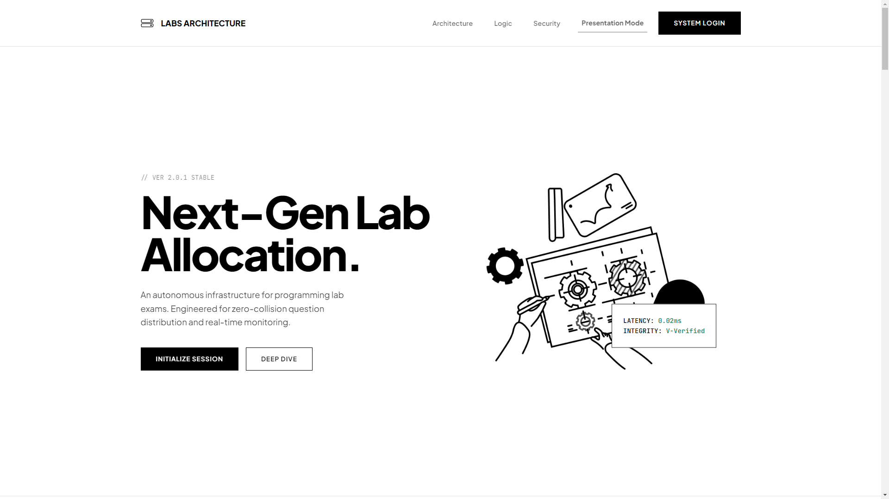

---

### A2 — Login Page

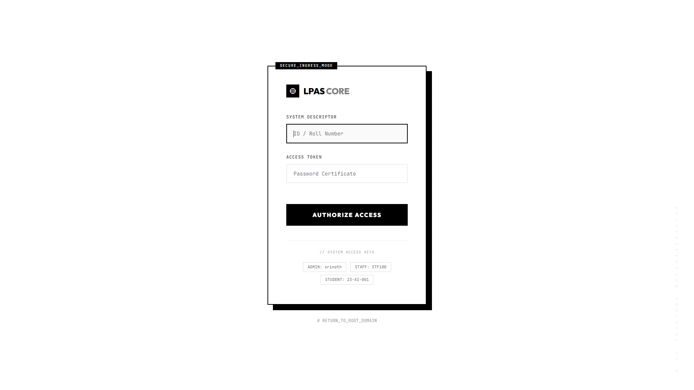

---

### A3 — Admin Dashboard

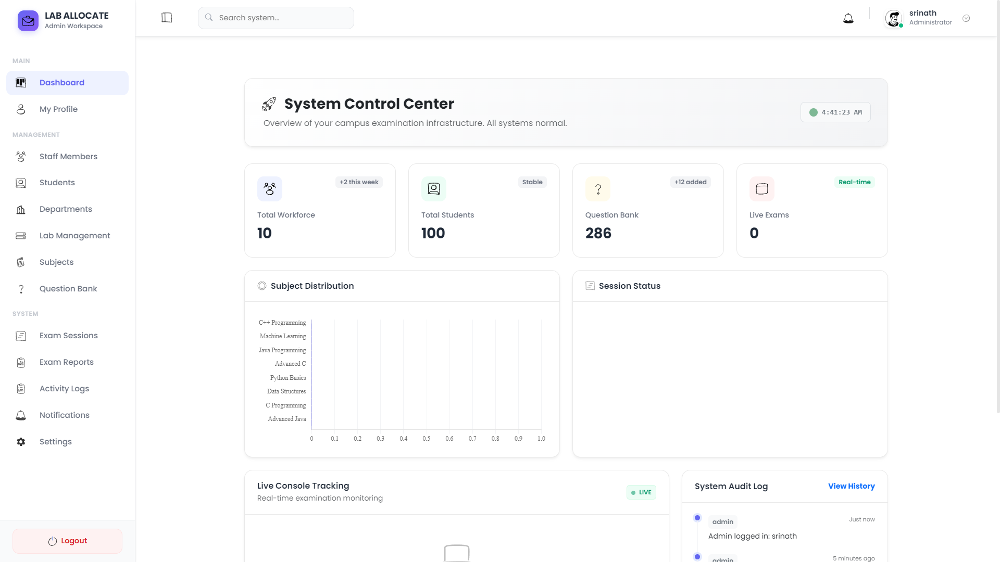

---

### A4 — Manage Students

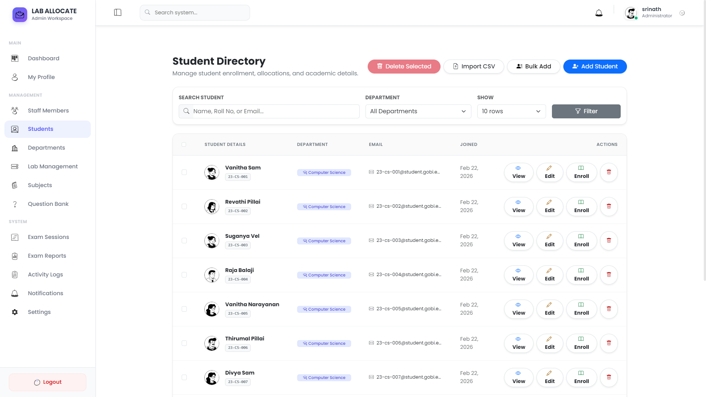

---

### A5 — Question Bank

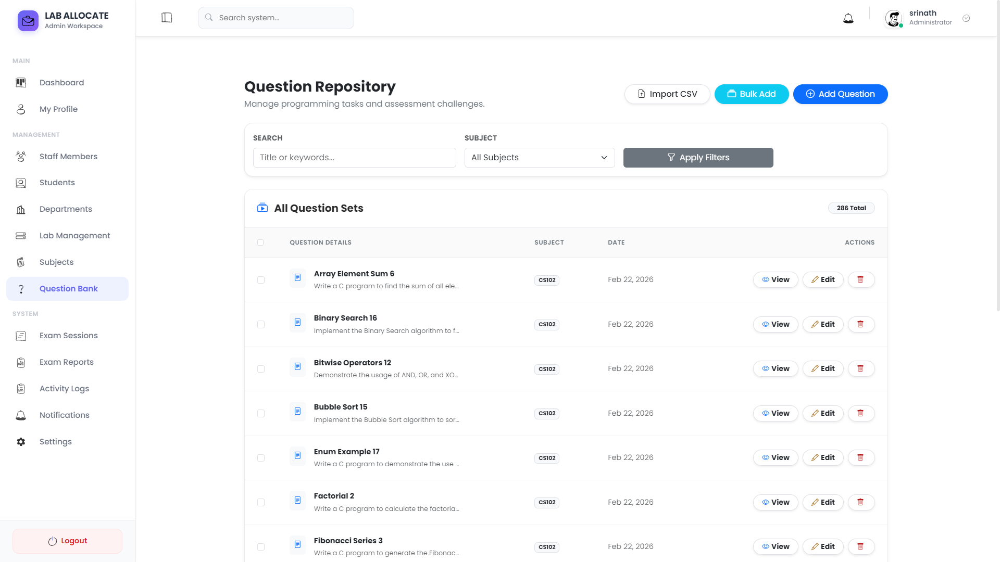

---

### A6 — Staff Dashboard

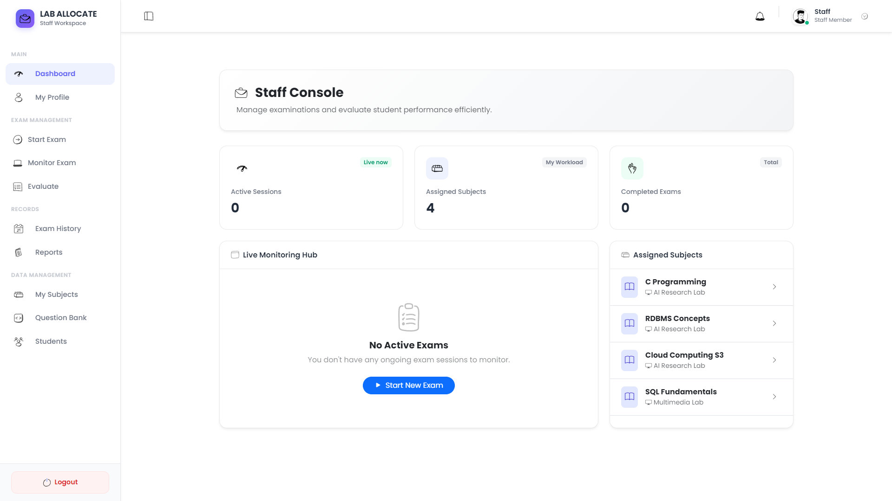

---

### A7 — Monitor Exam

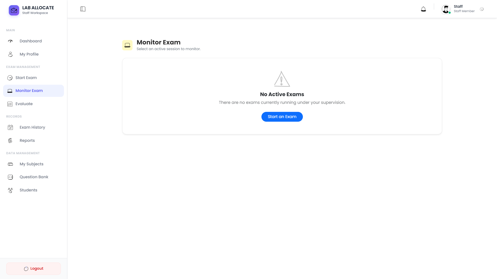

---

### A8 — Student Exam Interface

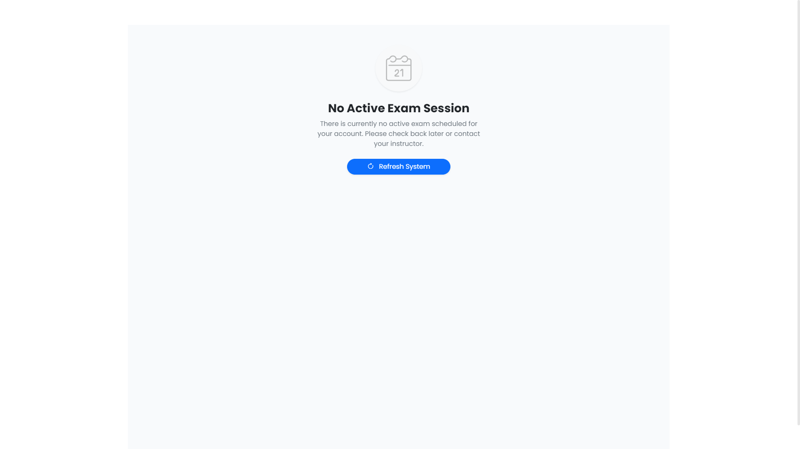

---

## Appendix B: Report Forms

*Result and report pages generated by the system.*

---

### B1 — View Results

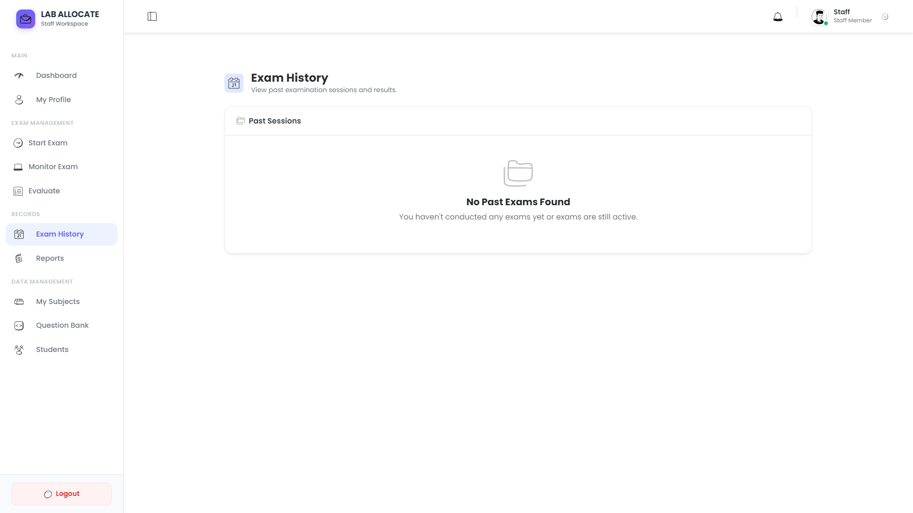

---

### B2 — View Session Details

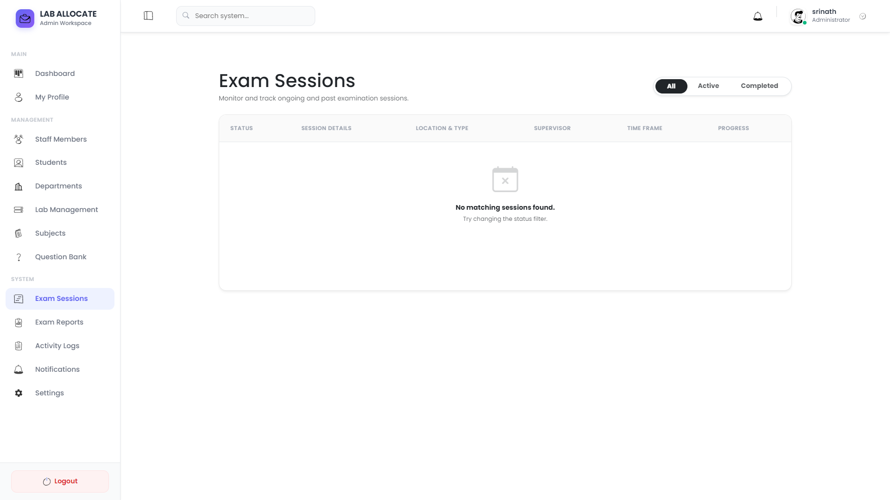

---

### B3 — View Submission

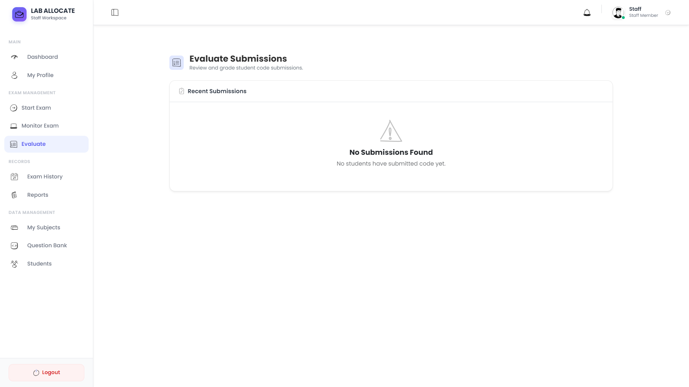

---

### B4 — Reports

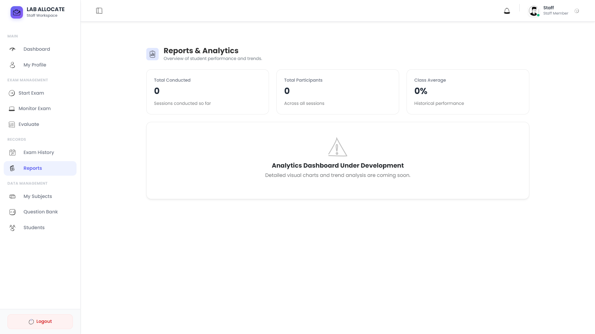

---
