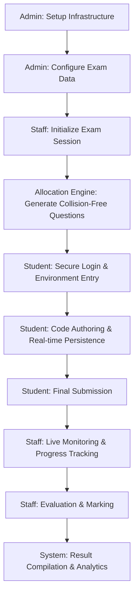
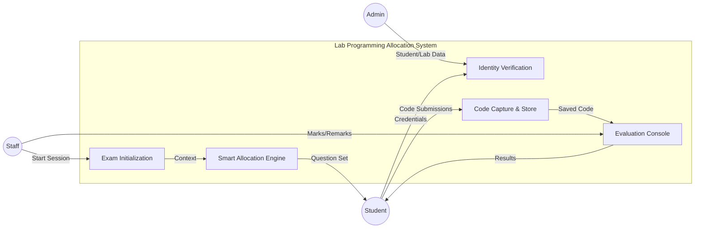
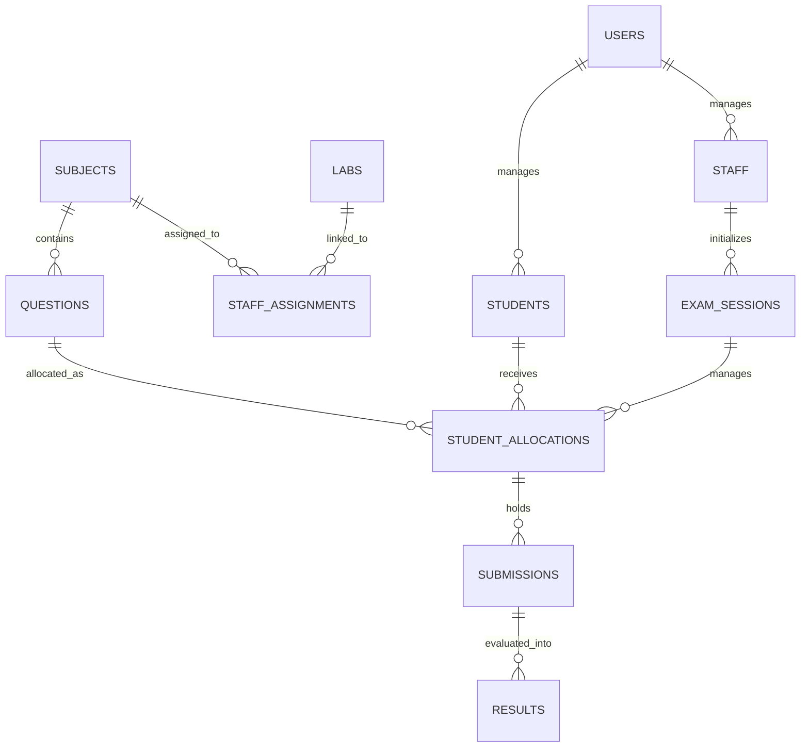
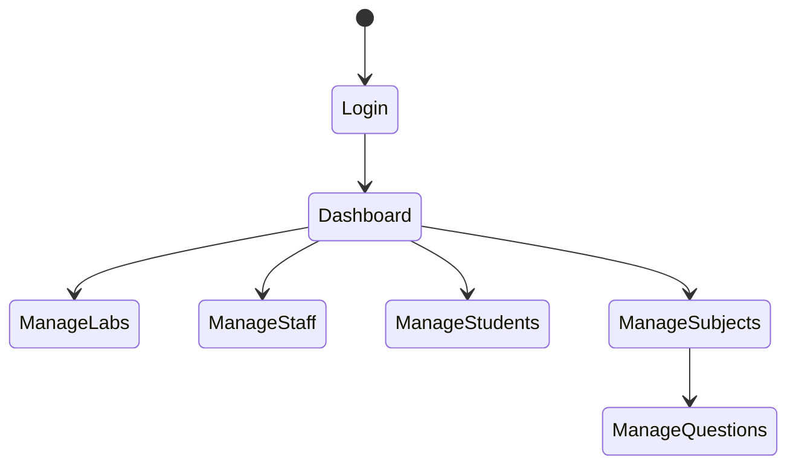
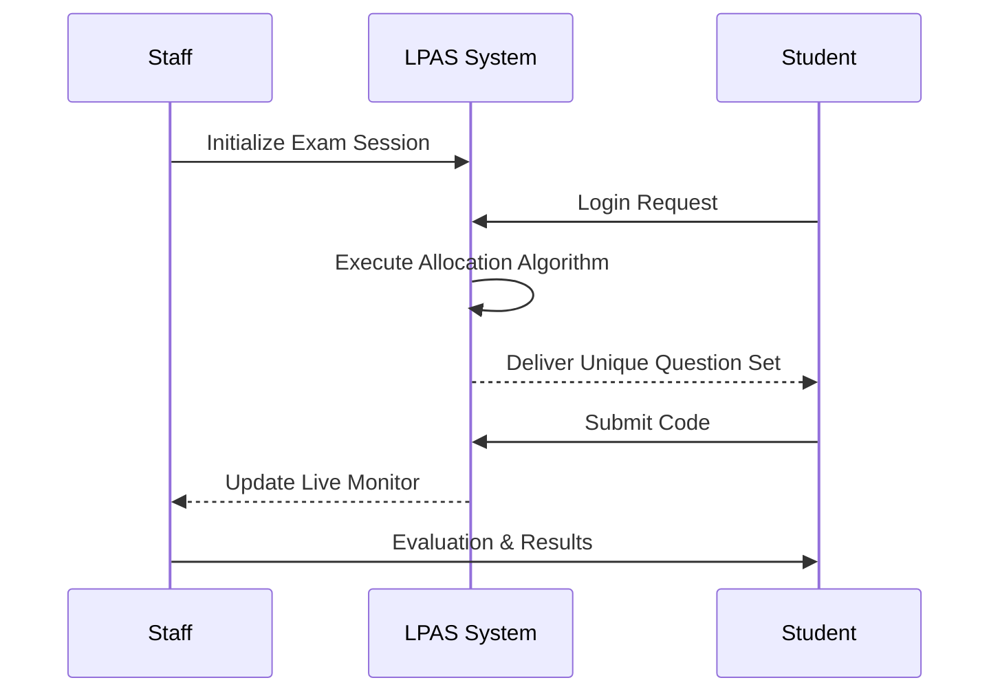

# Lab Programming Allocation System

## Technical Manual and System Documentation

The Lab Programming Allocation System (LPAS) is a sophisticated, offline-first web application designed to manage programming examinations in academic laboratory environments. Developed with a focus on academic integrity and administrative efficiency, LPAS automates question distribution through a spatial collision detection algorithm, ensuring a secure and streamlined assessment process.

---

## 1. Core Objectives and Problem Statement

In traditional laboratory examinations, maintaining academic integrity is a primary concern. The physical proximity of students often facilitates "shoulder-surfing" and unauthorized collaboration. LPAS addresses these challenges through:

- **Automated Spatial Allocation:** Intelligent distribution of unique question sets based on physical seating arrangements.
- **Administrative Monitoring:** Real-time dashboard for staff to track student progress, submission status, and system activity.
- **Submission Centralization:** Eliminating manual file handling by storing all source code directly in a secure database.
- **Offline Reliability:** Engineered to operate 100% locally on a LAN/Intranet, removing dependency on external internet stability.

---

## 2. Technical Features

### 2.1 Smart Allocation Algorithm
Located in `includes/allocation_algorithm.php`, the core logic treats the lab layout as a matrix.
- **Collision Detection:** Assigns 2 unique questions per student from a randomized subject pool (minimum 15 questions recommended).
- **Proximity Constraints:** Verified against adjacent seating (±1 seat) and vertical alignment (rows) to prevent identical questions for neighboring students.
- **Quality Verification:** The system performs iterative checks (up to 10 attempts) to ensure the highest entropy in distribution.

### 2.2 Security and Lockdown
- **Restricted Environment:** Integrated security protocols disable clipboard operations (copy/paste), context menus (right-click), and browser developer tools (F12) during active sessions.
- **Role-Based Access Control (RBAC):** Distinct permission tiers for Administrators, Staff, and Students.
- **Authentication:** Secure session management with Bcrypt-hashed password storage.

### 2.3 Integrated Code Editor
Uses the CodeMirror library to provide students with a professional-grade development environment featuring:
- Syntax highlighting for multiple languages.
- Line numbering and indentation support.
- Zero-dependency local persistence during the session.

---

## 3. Technology Stack

### Backend
- **Core:** PHP 8.2 (Leveraging modern performance optimizations and PDO for secure database interaction).
- **Database:** MySQL 8.0 (Relational schema designed for ACID compliance and consistent data integrity).

### Frontend
- **Interface:** HTML5, CSS3, and Bootstrap 5.3 (Premium Monochrome aesthetic for high-contrast clarity).
- **Logic:** Vanilla JavaScript (ES6+) for asynchronous state management and real-time UI updates.
- **Visualization:** Chart.js for administrative analytics and performance metrics.

---

## 4. Hardware and Software Specifications

### Server Requirements (Admin PC)
- **Processor:** Intel Core i3 (5th Gen) / AMD Ryzen 3 or higher.
- **RAM:** 8 GB DDR4.
- **Storage:** SSD (Recommended for low-latency database operations).
- **Network:** Gigabit Ethernet / WiFi High-Speed Access Point.

### Client Requirements (Student PC)
- **Browser:** Modern web browser (Chrome, Firefox, or Chromium-based Edge).
- **RAM:** 2 GB minimum.
- **Display:** 1366x768 resolution minimum.

---

## 5. System Architecture and Design

### 5.1 System Workflow
The following diagram illustrates the end-to-end technical process of a typical examination cycle.

### 5.2 Data Flow Diagram (DFD Level 1)
Illustrating the movement of data between external entities and the core system processes.

### 5.3 Entity-Relationship Diagram (ERD)
The database schema is optimized for consistency and high-concurrency write operations.

### 5.4 Directory Structure
- `/admin`: Administrative management modules.
- `/staff`: Invigilation and evaluation dashboards.
- `/student`: Examination and code submission interface.
- `/includes`: Core logic, security protocols, and allocation engine.
- `/config`: Database and system-wide configuration files.
- `/database`: SQL schema and migration scripts.

---

## 6. User Experience Flows

### 6.1 Admin Flow

### 6.2 Staff & Student Interaction

---

## 7. Installation and Deployment

### Automated Deployment
1. Install XAMPP to `C:\xampp\`.
2. Execute `START_SYSTEM.bat` located in the root directory.
3. The system will automatically initialize the MySQL database, configure local services, and launch the application in the default browser.

### Network Configuration
- **LAN:** Ensure all client machines are on the same subnet as the host PC. Access via `http://[HOST_IP]/lab-programming-allocation-system/`.
- **Hotspot:** Utilize the host PC's mobile hotspot for immediate, isolated network setup. Default IP is typically `192.168.137.1`.

---

## 7. Developer and Commercial Profile

**Developer:** Jaiganesh D. (iBOY)  
**Organization:** iBOY Innovation HUB  
**Official Email:** iboy.innovationhub@gmail.com  
**GitHub:** [https://github.com/iBOYJAI/](https://github.com/iBOYJAI/)

Jaiganesh D. is the Founder of iBOY Innovation HUB, specializing in Full-Stack Development, Artificial Intelligence integration, and scalable startup architecture. iBOY Innovation HUB focuses on building AI-powered SaaS platforms and modern digital solutions designed to solve real-world problems through innovative technology.

---

  <h3>Software Licensing</h3>
  
This project is licensed under the <b>MIT License</b>. Technical and legal provisions are detailed in the <a href="LICENSE">LICENSE</a> file.

   
  
<b>Developed by iBOY Innovation HUB</b>

  
<i>Innovation isn’t just what you do — it’s who YOU are.</i>

